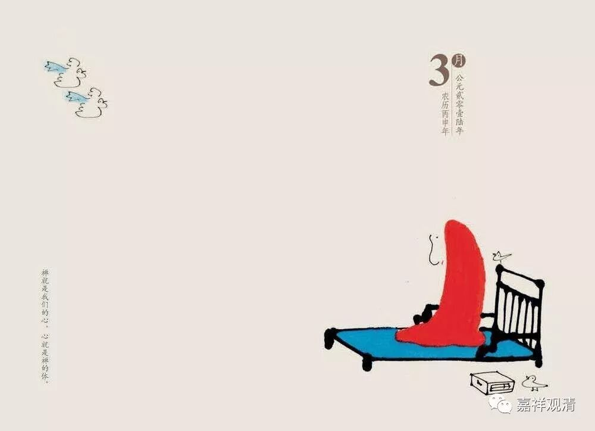

**《善说精髓》084（47）**

第四呢，“** 不正知**”

不正知的对治是正知而行，《广论》卷二说：

“总之，所有若昼、若夜一切现行，悉应忆念，了知其中应不应行，于进止时，一切皆应安住正知，谓我现前正行如是，若进、若止，若如是行，则现法中不为罪染，没后亦不堕诸恶趣，诸道证德未获得者，即住能得正因资粮。”

总的来讲，正知而行就是一切的行为都在自己的掌握之中，一切时不失去正念。

禅宗里有些故事都可以从这个角度理解。

有一位禅师拜访另一位大师。在准备告退时，大师问：“刚才进门时你把雨伞放在门的左边还是右边？”来访的禅师震惊了——他没注意。遂遣散徒众，在大师座下继续修禅。这个故事就是说，来访的禅师没有做到随时关注到自己的行为，没有做到“念念皆禅”，也就是他的“正知”的力量有没照顾到的时候，他的反省也很快，马上意识到自己的禅修还需要继续琢磨。

他是有没有照顾到的时候，我们比他厉害，我们是没有照顾到的时候。

还有一个禅宗公案：

雪岩钦禅师问弟子高峰妙禅师：白天你能做得主吗？

高峰妙禅师回答：能！

和尚继续问：梦里能做得主吗？

答：能！

问：正睡着时，无梦无想，能做得主吗？

高峰妙禅师愕然！

这个禅宗公案被后人解读得玄之又玄，机锋无数，离题万里。其实就是问，禅修中正知而住的能力如何？高峰妙禅师醒时梦里都能正知而住，已经是一等功夫，但师父继续捶打：正睡着没有梦时能不能做得主？若依教下，则是问的，在极端的闷绝位时能不能提起正念、正知而住？要求真高啊！

后来高峰妙禅师在隔壁同参枕头落地时，做到了！

