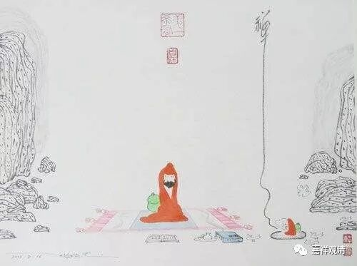

**《微课中观史》15·2**

然后呢，那烂陀寺有一个习惯，基本上所有的人都要试试讲经。于是，大家就想捉弄他，说：“什么时候请您给大家讲讲经呢？”寂天论师就回答说：“行啊！那你们是想让我讲你们已经听到过的呢，还是没听过的呢？”大家心里暗道：“咦？这家伙不学习，还摆谱，想忽悠我们，是吧？”然后就对寂天论师说：“那行啊，就讲我们所不知道的吧。”结果呢，他们就给寂天论师安排了法座，然后寂天论师就坐上去讲经了。

由于这个故事和周利槃陀的故事有点接近，很多版本就在这里转到周利槃陀的那个故事去了，而早期的版本还没有这个内容，那我们就讲一讲早期的版本……

寂天论师就在大家安排的一个日子开始讲课，他讲的是什么呢？他讲的他自己写的《入菩萨行论》——这个大家都没有听到过。当时大家一听：“哎哟，这个人很了不起嘛！”大家都听得很入神，他也讲得很起劲。

在这个后面呢，又出现了故事，说他在讲到《入行论》的“无缘最寂灭”的时候，身子就不显现了。这里面还有两种说法：一种是说他的身子就隐没了，看不见了，因为“无缘最寂灭”嘛；还有一种是说他的身子就越飞越高，越飞越高，就不见了。其实这些说法很有趣啊，如果他就不见了的话，那他后面说的这些，大家是怎么听到的呢？

但是，看起来寂天论师在讲经的时候可能还是入了神通，所以后来他就离开了寺院。从戒律的背景来看，在戒律当中，特别是声闻的戒律当中，你是不能随便露神通的，露了神通你要被驱摈的，要被赶走的，所以他就自我流放了，自己走了，就离开那烂陀寺了。

寂天论师离开那烂陀寺以后，他所讲的这部经典——《入菩萨行论》，大家都觉得很好，就背了下来。寺院想请他再回那烂陀寺，就派了人去找，最后在南印度找到了寂天论师。怎么说呢？寂天论师还是一个“行者”，或者说有点像自我流放那种感觉吧。哎，自我流放这个说法有点不太好，还是说到处参访比较好。他也没有太高调，被那烂陀寺专门派出来寻访他的人找到了，要请他回寺院，他就说：“我就不用再回去了吧。”

既然他没答应回去，寻访他的人就问：“既然你不回去，那么你上次讲的《入菩萨行论》能不能给我们留下来？现在外面流传的有三个版本，一个版本是八百颂，一个版本是一千颂，一个版本是一千二百颂，哪个才是对的？”寂天论师就笑着说：“那个一千颂的版本是对的。我这个书呢，写成文字了，在我原来那个房间的窗台的格子（或者墙缝）里面，你们可以去找找。另外，我还写了一部《集经论》，你们也可以在那里找。”所以寂天论师的这两部著作就这样保留下来了。

