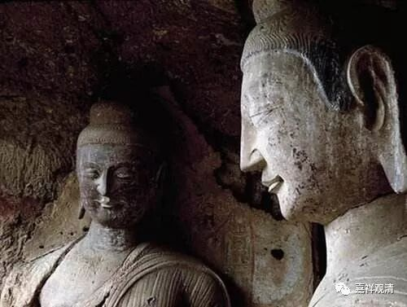

**《善说精髓》084（48）**

“饮食不知量”、“不护根门”、“长时睡眠而不精进”、“不正知”，此四是沉掉的共因。据《瑜伽师地论》，此四是沉、掉、乱、着的共因。

《瑜伽师地论》卷十一：

“何等沈相？谓不守根门、食不知量、初夜后夜不常觉寤勤修观行、不正知住。是痴行性，耽着睡眠，无巧便慧，恶作俱行欲、勤、心、观。不曾修习正奢摩他，于奢摩他未为纯善，一向思惟奢摩他相，其心惛闇，于胜境界不乐攀缘。

何等掉相？谓不守根门等四，如前广说。是贪行性；乐不寂静；无厌离心，无巧便慧，太举俱行，如前欲等不曾修举，于举未善唯一向修，由于种种随顺掉法亲里寻等动乱其心。

何等乱相？谓不守根门等四，如前应知。是钝根，多求、多务、多诸事业，寻思行性，无巧便慧，无厌离心，不修远离，于胜境界不乐攀缘，亲近愦闹，方便间缺，不审了知乱、不乱相。

何等着相？谓不守根门等四，如前应知。是钝根性，是爱行性，多烦恼性，不如理思，不见过患，又于增上无出离见。

对治如是应远离相。随其所应。当知即是应修习相。”

沉相，就是指的昏沉；掉相，就是指的掉举；乱相，即散乱；着相，应即昧着、耽着，以贪的行相为主。

“沉、掉、乱、着”四相之对治，就是“应修习相”。所以《瑜伽师地论》这段总说有五相。

道次第在相关章节没有展开，也没有在此处讨论“失念”、“不正知”、“散乱”这些和禅修有关的心所，有机会的话，我们可以继续讨论。在这些名词的理解上，安慧和护法几乎在每一个相关心所上都有不同。

上面引《瑜伽师地论》的文中，已经连沉掉的不共因都列出来了。如沉相的不共因，是“是痴行性；耽着睡眠，无巧便慧，恶作俱行欲、勤、心、观。不曾修习正奢摩他；于奢摩他未为纯善；一向思惟奢摩他相，其心惛闇，于胜境界不乐攀缘。”

这里的“欲、勤、心、观”，就是三十七道品里的“四如意足”。

