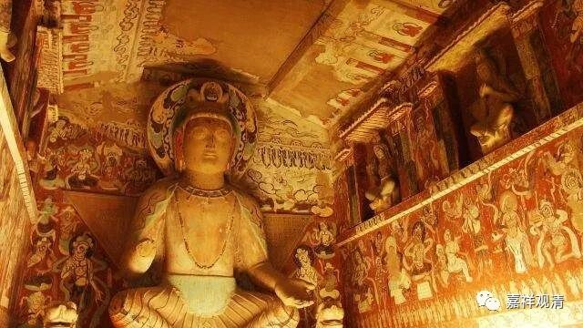

**《微课中观史》15·3**

很可惜，寂天论师的弟子是谁，有点不太知道，因为没什么记载。

我现在突然之间想到一个办法，好像可以知道，不是打卦哦。西藏好像是有《闻法录》这类东西的，比如说你听到《入菩萨行论》，假如你是一个大活佛的话，从谁那里听闻，一代一代要追溯上去的。所以，从大活佛的《闻法录》当中，可能可以找到寂天论师的弟子是谁。（当然，可能你又会发现寂天活了三百年……）

在一般情况下，我们好像不太了解，也基本上不知道寂天论师有哪些弟子传下来，没怎么听说过。应该说，他不是以讲经说法或者传授弟子为主的，他在后期主要是在山林之间行走的一个修行人。寂天论师的《入菩萨行论》是非常有名的，菩提心的修法中的自他相换法就跟《入菩萨行论》有关。

寂天还有一本《集菩萨学论》，估计是在写作《入菩萨行论》前他学习时候的一个辑录、摘录的作品，现在梵藏汉文本都有。藏文中还有一部《经集》是寂天的作品，有人说汉文里的《大乘宝要义论》就是这部《经集》。

寂天的年代，大约在公元650-70年0，因为他显然晚于月称，而且两人没有交集，中国的西行求法高僧们也没有提到过他，所以他的活动时间至少晚于月称、义净。

寂天以后是一长段印度中观历史的空白期，好像唯识学的发展也停滞了。大概是受到内外两个变量的影响：内变量就是佛教密宗的抬头，外变量就有吠檀多派商羯罗为代表的婆罗门教的强势崛起。

好，今天的佛教史就先讲到这里。

