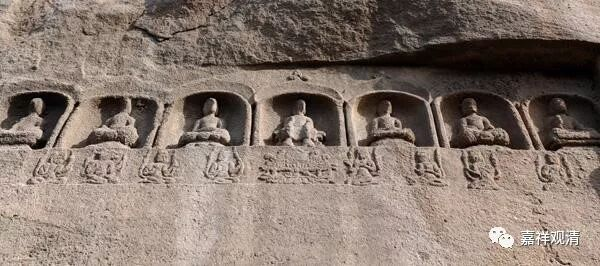

**《善说精髓》084（49）**

** “沉没因，耽着睡眠太依止，**

** 心暗不乐攀所缘。”

沉掉的不共因。首先，昏“**沉** ”的不共“**因** ”：

“**耽着睡眠”：** 太喜欢睡觉了。我有个师兄，还有个徒弟，都是“**耽着睡眠** ”，夏天八点钟我去敲他门，睡眼惺忪穿着短裤就开门了。我那个师兄，一上座就睡觉，坐在蒲团上，只有腰以下像禅修。还有个师侄，我想教他怎么对付打坐时的瞌睡，还没说两句，他很诚恳地告诉我：“师叔，你饶了我吧，我打坐的时候就是真的想睡会儿。你说的是修行，我是真想睡觉……”

** 

** “太依止”，**修止太过，也会引发昏沉、沉没。这是压服心的力量太过了。

** “心暗”**：内心昏暗。

“** 不乐攀所缘**”：这里不是说他放得下不在世俗上“攀援”，而是说不喜欢修禅定，不喜欢安住在所缘境上。

《瑜伽师地论》说的昏沉的不共的因还想内容还要多一些——“是痴行性，耽着睡眠，无巧便慧，恶作俱行欲、勤、心、观。不曾修习正奢摩他，于奢摩他未为纯善，一向思惟奢摩他相，其心惛闇，于胜境界不乐攀缘。”

大概可以理解为，《善说精髓》是举了第一个和最后三个，中间的类似今天用省略号略过了。“耽着睡眠”之前的“痴行性”是说的它的体性（增上）部分也可以略过。

所以，补足《瑜伽师地论》所说的话，沉没的不共因有九：1、是痴行性；2、耽着睡眠；3、无巧便慧；4、恶作俱行欲、勤、心、观；5、不曾修习正奢摩他；6、于奢摩他未为纯善；7、一向思惟奢摩他相；8、其心惛闇；9、于胜境界不乐攀缘。

其中第四“恶作俱行欲、勤、心、观”，此“恶作”即“悔”。《广论》及《四家注》说的是“懈怠俱行欲、勤、心、观”，“懈怠”看起来比“恶作”更合理些。“懈怠俱行欲、勤、心、观”，就是带着懈怠的“欲、勤、心、观”四者。“恶作”“俱行欲、勤、心、观”似乎说不太通。

