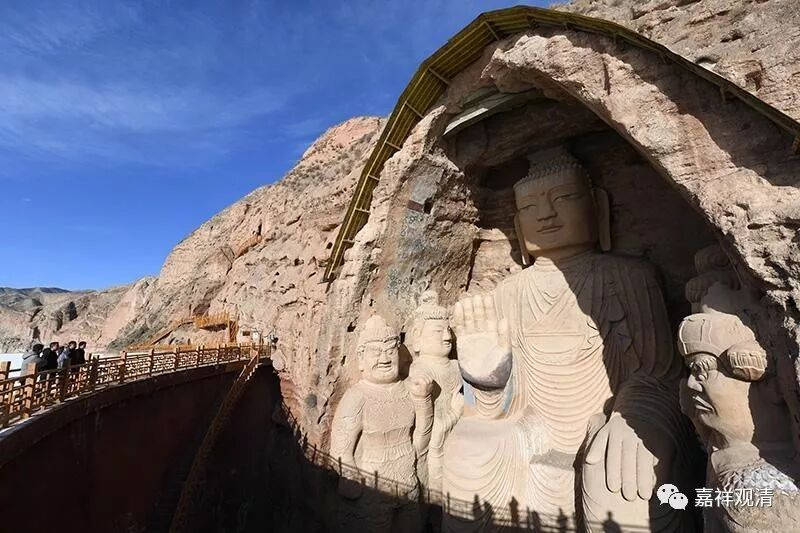

**微课堂佛教史016·1**

好，今天我们还是继续佛教史。

上次已经谈到了中观派的中期历史，谈到了寂天论师，也把他的故事讲了一下。以我们现在来看，他的故事当中传说性的内容比较多，主要是因为汉地对他这个人不了解。他的故事基本上都是藏地保存下来的，而藏地流传的故事大家都知道的，历史的真实比不上传说的加工。

传说的加工中，寂天也像周利盘陀一样被请到一个高台，这是寺院的和尚准备捉弄他、看他的笑话，然后被寂天论师识破，以神通上了高台，演说他的《入菩萨行论》……

关于寂天论师的弟子，好像没有什么特别的说法。昨天我们说了，可能可以用另外一种方法——去《闻法录》当中看看，也许可以找出来。寂天论师具体有哪些弟子，大家基本上叫不出来，也可能是因为他后期各个地方游走得比较多，就是修行人的这种性质——这样说也不是很好，因为大家“** 都是”**修行人嘛。反正寂天论师晚年的主要情况就是他四处游方。

我有一个瞎猜啊：或许寂天论师就是一个寺院里默默无闻的高僧，直到去世以后，寺院才在他的房里发现他的几部作品。

那么，寂天论师最主要的作品就是《入菩萨行论》，汉地在宋代的时候就有过翻译，但说是龙树菩萨所造。从这个角度来说，可以说大概在宋代时候的印度，至少有一支佛教派系已经对寂天论师这个人物不算很了解了，因为汉地当时翻译的《入菩萨行论》，叫《菩提行经》，说是龙树菩萨造的——那个时候对这部论的原作者寂天已经不怎么知道了。

这些就是寂天论师大致的故事，再多的故事和作品现在也不是很清楚。

我们已经大致讲了中观派中期的论师们所著的作品：佛护论师的主要作品是《佛护释》，就是佛护论师对《中观论》的注疏，现在多半称为《佛护释》；清辨论师的主要作品是《般若灯论》，实际上也是对《中观论》的注疏。清辨论师的作品是比较多的，还有一部《思择焰论》，又名《中观心论颂释》，而《中观心论》也是清辨论师的作品。他还著有《大乘掌珍论》、《异部宗精释》等作品。

上次我说过，《思择焰论》已经翻译出来了，也给大家推荐了。不过，现在好像只有破外道的部份，没有翻译完全，是吧？不知道什么时候能把它翻译完全，很想看到啊。

