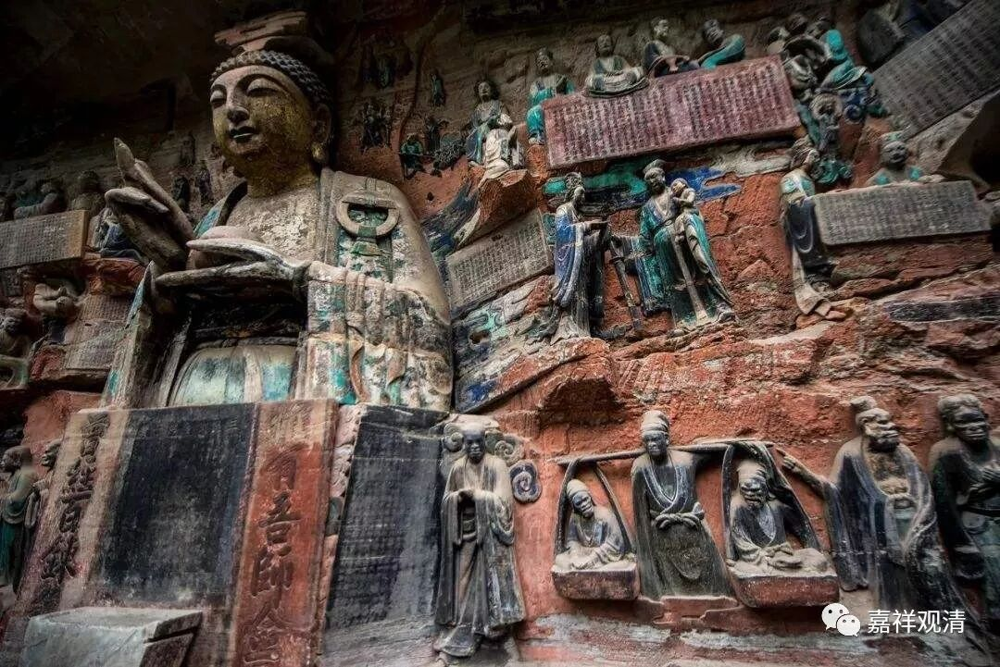

**《微课中观史》15·2**

那么，月称论师的著作就比较多了，主要是对早期中观师的论典的注疏。比如月称论师对龙树菩萨的《中观论》的，现在一般称为《明句论》，这部论典的藏译本是全的，现在好像还没听说有人在翻译成汉文，英文和日文都已经翻译全了。然后还有对《六十如理论》、《七十空性论》和《四百论》的注疏。月称论师最重要的代表著作，大家记得最清楚的就是《入中论》和《入中论自释》。他还有一部《归依七十颂》。另外有一部《五蕴论》，我上次讲课的时候提到过，不知道是不是这位月称法师的作品，只是在藏经的目录当中看到过。

我们前面讲过在这个时期的中观师当中，还有和玄奘法师同时的智光论师，历史上有过这位人物，但是他并没有什么作品留下来，到现在也没发现。佛教历史上这个情况非常严重——作品的遗失率非常高。龙树大师也是有相当多的作品，就那么没了。智光论师包括清辨论师可能都有很多很多的作品都没有了。

这里面有几方面的原因，其中之一就是以图书馆的方式来保存书籍的习惯没有，没有形成一个保存的制度，一般只是靠少数人或者个别人的灵光一闪——个别人有这种收藏文献的习惯。藏地也是一样，很少有收集书籍的习惯。像二世嘉木样大师这种就是非常特别的一个情况了，他就为拉卜楞寺收集了当时很多的经典。甚至一些传承都有这个情况，他会专门派人去收集快失传的传承，比如断法。

另外，印度人似乎天生不喜欢文字而喜欢“口传”……或许是因为他们的文字确实难，让他们觉得太强调文字会失去传播的力量。

汉地在这个方面稍微好一点。但是汉地有过几次法难，也是比较大的麻烦。汉地总结整理的《大藏经》或者说《一切经》这种模式，对佛教来说是一种比较好的保护文献的方式。

智光论师的作品没有保存下来，但是听说他有一部《般若灯论》。那么按照《般若灯论》这个书名来看，他可能是清辨论师那一系的。

