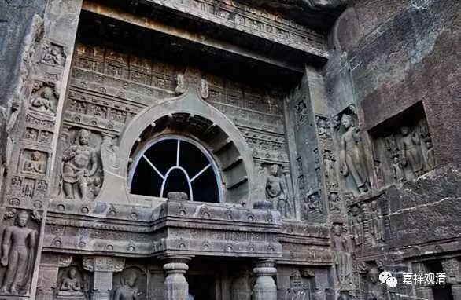

**《微课中观史》15·3**

寂天论师的作品，前面已经讲过，主要《集学论》——《集菩萨学论》和《入菩萨行论》这两部。他还有一部著作，叫《经集》，又叫《一切经集要》，，而在汉传当中好像有一部《集经论》署名龙树菩萨的。

这个事情我们在以前讲过，印度有这样一种习惯，同一个流派的作品最后就都总结到一个人身上去了。在后期藏地的传说当中，中观派中期或者中后期的这几位论师，就直接说成龙树菩萨的弟子了。假如从历史上来说，应该不是。当然，这么说也是有原因的，一个就是大家都认为龙树菩萨很长寿，看传记好像也确实如此，哪怕是最早的汉文的文献和保存的传记当中都说了龙树菩萨很长寿。他长寿到什么程度呢？假如要长寿到公元六、七世纪的话，那他确实要有五、六百岁了，而藏地就说他活到六百多岁。问题是，假如他活到六百多岁的话，从汉地过去印度的这些法师都应该碰得到他，至少也会听说龙树菩萨那时候还活着才是，但从他们带回的历史记载来看，应该不是。

在汉文的南北朝时期的文献当中，就有过这样的记载，就是印度人把一年分成三季，然后我们的一年他们算三岁。上次龙相师讲的一个说法，说是一年分六季，我没听到过，不知道出处，但有可能是有这样情况的。就是说，如果有一个人的寿命说是九十岁的话，因为一年算三岁，很有可能他实际只有三十岁。如果是按龙相师的说法一年分六季的话，过六次生日，那有可能实际就是十五岁了——这种说法是有可能的。南北朝时期的文献当中就提到过这样的情况，一年算三岁。印度一年的三季就是雨季、旱季和夏季。

一般都是传说龙树菩萨活了六百岁的，如果是真正按现在的算法讲六百岁，有点不太可信的样子，至少唯物的我不太相信。一百岁已经是相当长寿的一个人了，活到一百岁还是有可能的，因为传记当中说他从小就学习治病的方法，修习长寿的咒语等等。

那么，我现在主要讲的中观派的论师们的显宗的作品，他们的密教著作我不太清楚，也没法讲。

好，今天的佛教史先讲到这里，谢谢大家。

