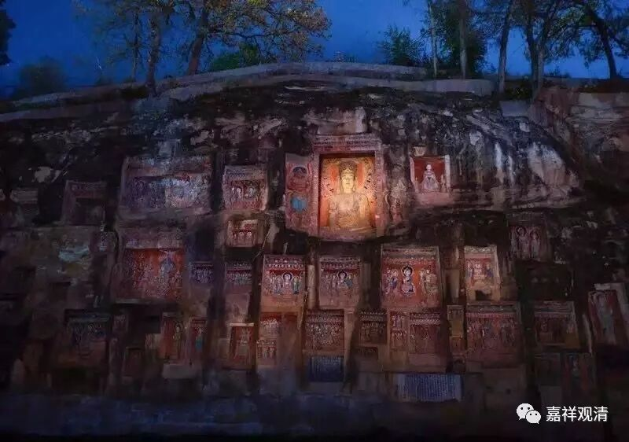

**微课堂佛教史017·1**

好，继续我们的佛教史。

这里所讲的其实都是一些知识方面的内容，大家平时轻轻松松地听听，有什么问题可以在礼拜六、礼拜天提出来，我不一定在网上，反正有什么要问的你们先写出来看看，到时候我们都可以聊一聊。

我们现在讲到中观派中期的几位重要人物，差不多已经讲完了。中观派中期最重要的人物就是佛护论师、清辨论师、月称论师和寂天论师，还有一位智光论师。那么，智光论师的年代就相当于玄奘法师那个时候。

我们并不是说就没有其他的中观师了，但是这几位法师留下了一些文献，我们是基于文献来谈的。现在来讲，那个时代的中观派分为以月称论师为代表的中观应成派和以清辨论师为代表的中观自续派。这样一个定型——中观派分为中观自续派和中观应成派，其实是在宗喀巴大师决择之后，并且也区分了两派核心观点的差异。

在此以后的文献就不多，人数应该是还有的。那个时代的中观派，看起来好像实力不是那么强，而当时的唯识派就表现出很强的实力。玄奘法师赴印度从那烂陀寺带回来的传说，也是以唯识派的大师们作为那烂陀寺的主力。其实那烂陀寺不是专攻唯识派的，但是唯识派重要的论师会比较多一点，中观派的论师好像不多或者没怎么听到，虽然现在藏文的资料里面，好像每个大师都是从那烂陀寺出来的。

有一个比较有趣的现象，我曾经稍微关注了一下。玄奘法师去印度那么长的时间，也有《大唐西域记》的记载，对吧？但是他所提到的中观派的论师很少，是不是有提到可能都是个问题。只有后来他和智光论师之间有过信件的往还，大概也只有这个了，其他的我真的不记得有过什么关于中观派论师的记载。

有一个现在比较流行的说法，其实我一直是存疑的。就是唯识系统当中讲，玄奘法师曾经写过一部沟通唯识和中观的著作，叫做《会宗论》——会是开会的会，宗是宗派的宗，意思就是会通中观和唯识。唯识系统一直有这个说法，但是肯定没有汉文本出现，对吧？

我对这个说法稍微有点怀疑，什么原因呢？因为从玄奘法师的学习经历上来看，在汉地没有看到过他专门学习中观派的历史或者记载，没看到过他跟哪位中观派的大师学过。在印度也没看到过他跟哪位中观派的大师学过，他去学习正量部的记载倒是有的，学习有部的也有，在《大唐西域记》和玄奘法师的传记当中都可以找得到。但是他专门留下来在某个人那里学中观的好像没有，以我对玄奘法师的传记的了解程度，我实在是想不出他跟哪位中观派的论师学过中观派的论典。如果没有的话，那他写过沟通中观派和唯识派的论著《会宗论》的传说，我就觉得有点可疑，很有可能是玄奘大师一系的门人的传说而已，或者说仅仅是唯识系的人理解的中观而已。

