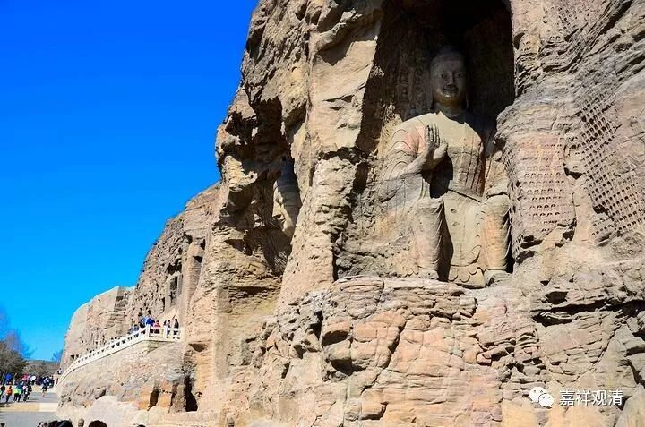

**《微课中观史》17·2**

假如真有这件事情的话，玄奘法师的传记当中总得要出现几位智光大师以外的中观派论师嘛。智光大师和他差不多算师兄弟的性质，或者说同一辈的性质，那么除了智光大师之外，应该还有对其他中观派论师的介绍，包括像月称论师或者清辨论师的弟子等等，是应该有的，但是实际上好像没有。

这是我个人的一个怀疑点，提出来请大家一起帮忙看看，玄奘法师的传记当中有没有专门提到过中观派。玄奘法师的传记当中是有提到过大众部、上座部，也提到过正量部、犊子部等等，但是好像就是没有专门提到过中观派。这几乎是在刻意避免提到中观师一样。几部玄奘法师的传记、游历里都没提到同时期的中观师，是不是有点奇怪……

另外还有一个情况，就是熊十力先生和张建木先生两个人提到的一个问题。嗯，这个内容属于我们私下的聊天，就是不一定要到外面去这么讲。我们说过，多罗那他的《印度佛教史》是由张建木先生翻译的，是吧？熊十力先生和张建木先生他们提到一个说法，这个说法当年在支那内学院当中掀起过一次大的辩论。

熊十力先生大家都知道的吧，中国近现代儒家学派的三位代表人物——熊十力、马一浮、梁漱溟，是吧？熊十力先生曾经在支那内学院，在欧阳竟无先生的座下学习过一、两年还是几年，他向欧阳先生过学，问过唯识，后来被梁漱溟先生请到北大去讲唯识。

张建木先生和熊十力先生提到一件什么事情呢？额，说还是不说呢？算了，不说了吧，现在人太多了，两个群加起来有好多人了，就暂时不说了。稍微提示一下，假如说玄奘法师确实在印度那烂陀寺见到了很多中观师，但是又刻意地回避记载的话，那就有点非常特殊了。这种情况有没有可能性呢？就是说他确实有在印度见过很多中观师，但是又在他所有的记载当中刻意地回避这件事情。这种可能性到底是有还是没有呢？或者这么说吧，这可能性是有的。

可以说在那个时代的后期，也有一些人认为这件事情是有的，但到底是谁呢？比如说，道宣律师是不是这样认为的？道宣律师写过《续高僧传》嘛，那么，这部论著的文笔到底是不是道宣律师本人的，也是在这场争论当中要提到的一个问题。《续高僧传》成书的年代和最终定稿的年代，是不是存在前后的差别？现在看来应该是有的，就是之前的作品算是一个稿本，到后来就变成定本，而定本的人未必是道宣律师本人。现在我们手上的《续高僧传》相当于定本，很有可能是经过后人的增补，而这个增补当中，是有一些内容加在里面的。

加了什么内容呢……

《續高僧傳》的《玄奘传》后面是《那提传》，那一卷只有他们两个人。按照史家笔法，这两个人放在同一卷当中，可以认为是有什么暗示的。而，那提正是龙树学派的。

