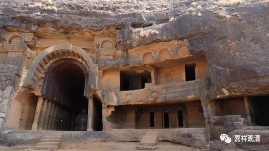

**《微课中观史》17·3**

如果中观派中期的论师里面还要再加人的话，我上次好像也提到过一个，其实我一直不知道应该把他放在什么地方比较好，是放在中观派的早期呢，还是放在中期呢？这个人就是注解《菩提资粮论》的自在比丘，他的时代到底应该算在哪里？或者说，应该把他算作中观师，还是唯识师呢？

今天已经讲了十分钟了，熊十力先生和张建木先生的那件事情稍微讲一下也是可以的……

其实有时候大家吵一吵也挺好的，当年熊十力先生和张建木先生在支那内学院就这件事情进行嚷嚷起来之后，大家就对《续高僧传》成书的年代和成书的次序越来越明确了。最后，基本上可以认定道宣律师先编写了这本《续高僧传》，到了后来又经过了增补。但增补的这个人，到底是道宣本人还是别的谁，还没统一的认识吧。（也许有新的讨论，我没看到。）

总的来说，在《续高僧传·玄奘传》后面加上《那提传》的人，不论这个人是道宣律师本人还是其他的谁，都是有“春秋笔法”的。如果因为这个《那提传》是后来加进去的，而据此完全推翻说此传为伪则似乎也有点过……而且，义净法师似乎也提到过此人呢。

其实，作为铁杆唯识师排斥中观，或者反过来，作为铁杆中观师没事儿就砍砍唯识，这都是历史上常见的现象啦。应该说，这种“比较激烈的讨论”也就是佛教界一贯的“学术环境”，是“了不了义”之争而已，不是非要把对方揍死的性命相搏。

其实有学术争论也是个好事情，如果学术争论都没有了，万马齐喑，也未见得是好事，变成铁板一块、死水一潭了。争论当中，血压高点，肾上腺素、甲状腺素飙一点也都正常，毕竟不是人人都是佛，是吧？慢慢修呗。

我们看晚期的中观唯识，很明显就是中观和唯识打着打着又走到一起去了，胜义上承认无自性，世俗上按瑜伽行派这套来解释，藏地管这叫“顺瑜伽行的自续中观派”，或者叫“中观自续顺瑜伽行派”。先不论学派名称的安立，这些“胜义上承认无自性，世俗上按瑜伽行派这套来解释”的人当中，既有传统上属于中观门下弟子，也有谱系传承来自瑜伽行派的大师，看起来，就是大乘的这两大系统的弟子们，辨着辨着又走到一起去了……

好，今天佛教史先到这里。

