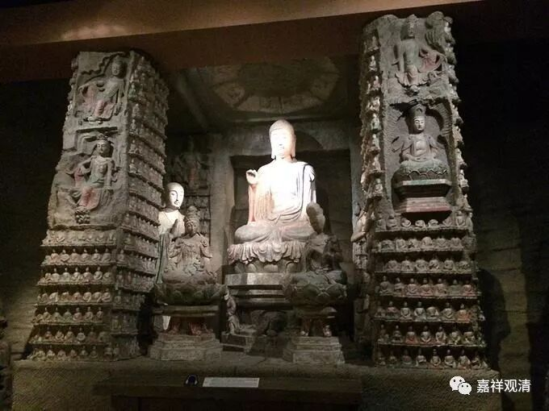

**《善说精髓》084（55）**

八断行

五过失

信、欲、勤、轻安

懈怠

正念

忘念

正知

沉没、掉举（为一）

行思

不作行

舍

作行

接着说后四种过失的对治：

以“正念”对治“忘念”。“念”，就是“于曾习境，明记不忘为性”，《集论》说是：“何等为念？谓于串习事，令心明记不忘为体，不散乱为业。”就是对以前学过的相关禅修的内容不忘失，类似禅宗说的“照顾话头”。

以“正知”对治“沉掉”。这个前面讲了很多了，因为觉知沉掉而断除沉掉。正知的体就是慧心所，是对身语意的正确抉择。《集论》：“何等为慧？谓于所观事择法为体，断疑为业。”

以禅修相应的“思”对治“不作行”：前面“正知”部分是觉知沉掉，这里要以相应的造作、行为来对治，而不是放任的“不作行”。《集论》说：“何等为思？谓于心造作，意业为体，于善、不善、无记品中役心为业。”

以平等、不干涉的“舍”、“不作行”，来对治过分的干涉已经平静的内心——在沉掉已经灭除、也不会马上生起的时候，应当避免过分干涉，要求做到“心平等性、心正直性、心无功用住性”。《集论》说：“何等为舍？谓依止正勤、无贪、无瞋、无痴，与杂染住相违，心平等性、心正直性、心无功用住性为体，不容杂染所依为业。”

《辨中边论》卷中说：

** “记言觉沈掉，伏行灭等流**

** ……**

** ‘记言’谓‘念’，能不忘境，记圣言故。**

** ‘觉沈掉’者，谓即‘正知’，由念记言，便能随觉惛沈掉举二过失故。**

** ‘伏行’谓‘思’，由能随觉沈掉失已，为欲伏除发起加行。**

** ‘滅等流’者，谓彼沈掉既断灭已，心便住‘舍’平等而流。”**

