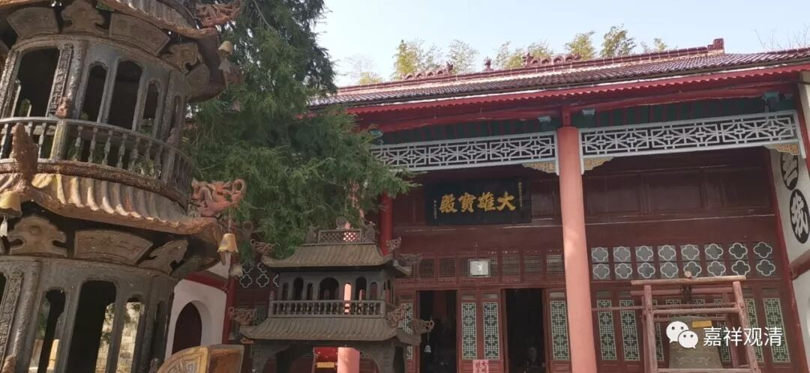
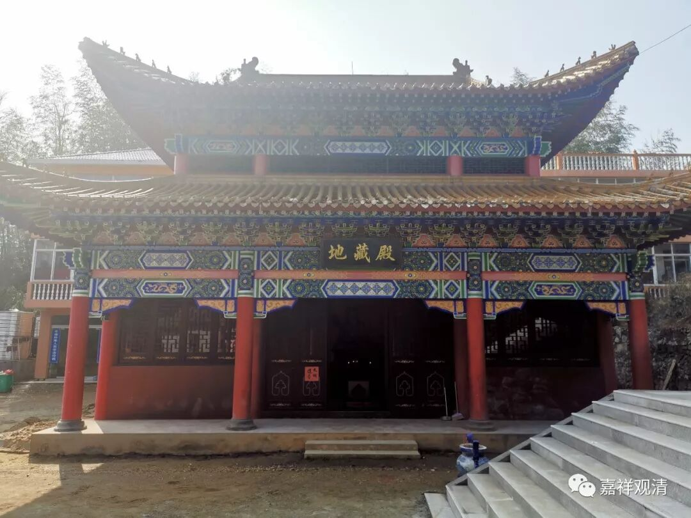
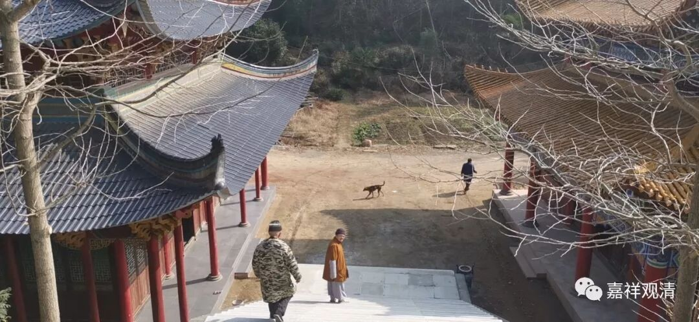
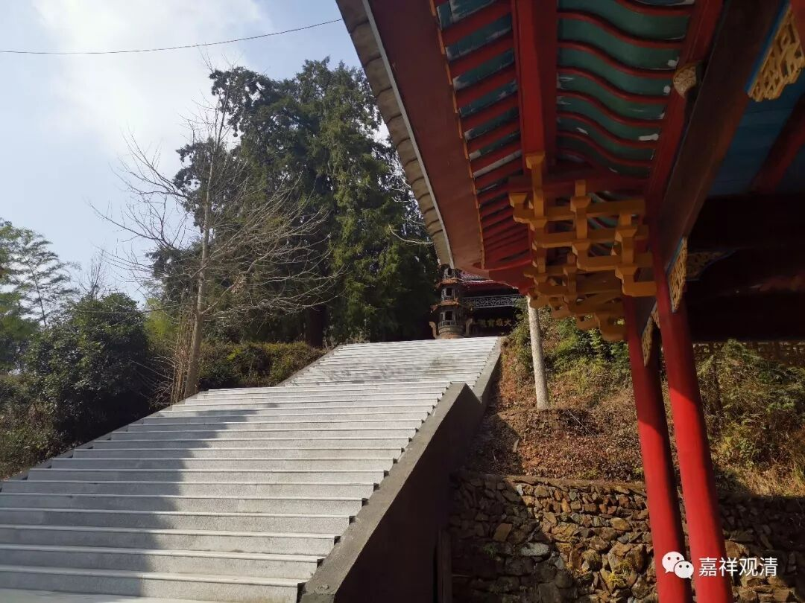

**莲花山白云寺新年春节进香祈福公告**

自去年入冬以来，中国各省市爆发了名为“新型冠状病毒感染肺炎”的疫情，相关部门部署了一系列及时的、有力的疫情防控措施。农历春节期间，正值寺院外来人员大量汇集之时，为保障大家有一个吉祥安康的新春佳节，莲花山白云寺在此向广大信众、义工、游客们提出以下建议：

一、请广大的信众、香客、游客们及时充分地做好自身的卫生防护工作。建议进山、入寺时自行佩戴口罩，礼佛进香后，不建议长时间在人群中逗留。

二、推荐各位信众在家中念经、祈福或网上祈福，确保自身安全。将来可以在适当时间来本寺礼佛、参访、游玩。

三、春节期间，如在白云寺内发生特殊情况，可及时与身边的义工、工作人员联系，我们会及时处理相关事件。

四、若相关部门有新的举措、文件，我们会及时公布，也希望大家能够配合我们的工作，落实相关政令。

莲花山白云寺祝大家新春吉祥！健康长寿！

愿灾障消除，人民安乐，国家富强！

莲花山白云寺

2020年1月23日

