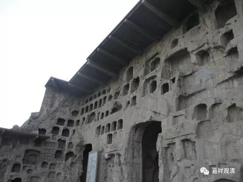

**《善说精髓》084（56）**

** “如是八行断五过，无上瑜伽中亦需。”**

这样的以八断行来断除五种过失，是修禅定共通的学习内容，大小乘乃至密乘的无上密部分也一样应该遵照而修。在这里专门强调的原因是，很多修定、闭关专修的人并不了解相关教授，宗大师认为，那样去禅修，将无法获得期望的结果。

** “午二、依彼引生住心次第**

** 分三：未一、正说引生住心次第，未二、由六力成办之理，未三、具四种作意之理。**

“** 引生住心次第**”，就是通向禅定的过程。这里又是一段九住心和六力、四种作意的内容，也全部出自瑜伽行派系统的论典。

先说“九住心”；

** 未一、正说引生住心次第”**

** 

** “内住续住及安住，近住调伏与寂静，

**最极寂静并专注，平等住九令生故。”

九住心，为：1、** 内住**；2、** 续住**；3、** 安住**；4、** 近住**；5、** 调伏**；6、** 寂静**；7、** 最极寂静**；8、** 专注（一趣）**；9、** 平等住。这九个之后就迈入最初的禅定了。

《广论》顺《瑜伽师地论》、《大乘庄严经论》、《修次第》初篇，说：

“一、內住者，謂從一切外所緣境攝錄其心，令其攀緣內所緣境。《莊嚴經論》云：‘心住內所緣。’

二、續住者，謂初所繫心令不散亂，即於所緣相續而住。如云：‘其流令不散。’

三、安住者，謂由忘念向外散時，速知散已，還復安置前所緣境。如云：‘散亂速覺了，還安住所緣。’

四、近住者，《修次初編》說，前安住心是知散斷除，此近住心是散亂斷已，勵力令心住前所緣。《般若波羅蜜多教授論》說，從廣大境數攝其心，令性漸細上上而住，如云：‘具慧上上轉，於內攝其心。’《聲聞地》說：‘先應念住，不令其心於外散動。’謂起念力，令不忘念，於外散動。

五、調伏者，謂由思惟正定功德，令於正定心生欣悅。如云：‘次見功德故，於定心調伏。’《聲聞地》說，由色等五境、及三毒、男、女隨一之相，令心散動，先應於彼取其過患，莫由十相令心流散。

六、寂靜者，謂於散亂觀其過失，於三摩地止息不喜。如云：‘觀散亂過故，止息不欣喜。’《聲聞地》說，由欲尋思等諸惡尋思，及貪欲蓋等諸隨煩惱能擾亂心，先應於彼取其過患，於諸尋思及隨煩惱不令流散。

七、最極寂靜者，謂若生貪心、憂慼、惛沈、睡眠等時，能極寂靜。如云：‘貪心憂等起，應如是寂靜。’《聲聞地》說，由失念故，若起如前所說尋思及隨煩惱，隨生尋斷，能不忍受。

八、專注一境者，為令任運轉故，而正策勵。如云：‘次勤律儀者，由心有作行，能得任運轉。’又如《聲聞地》云：‘由有作行，令無缺間，於三摩地相續而住，如是名為專注一趣。’第八心名專注一趣，即由此名易了其義。

九、平等住者，《修次》中說，心平等時當修等捨。《般若波羅蜜多教授論》說，由修專注一趣，能得自在任運而轉。如論云：‘從修習，不行。’《聲聞地》說名等持。如云：‘數修數習，數多修習為因緣故，得無功用任運轉道。由是因緣，不由加行，不由功用，心三摩地任運相續，無散亂轉，故名等持。’

此中九心之名，是如《修次初編》所引，如云：‘此奢摩他道，是從般若波羅蜜多等所說。’”

