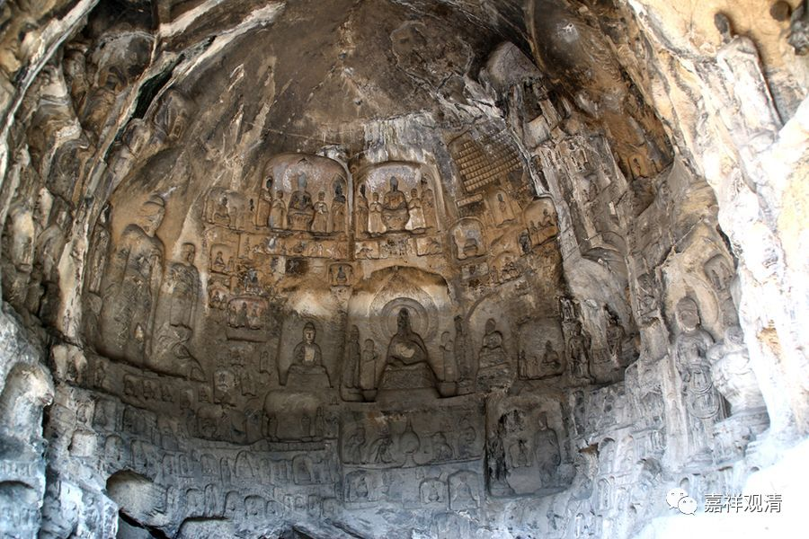

**《微课中观史》18·2**

那我们首先来讲一下静命论师或者寂护论师。静命论师呢，他生活在公元七百多年、八百年不到的时候，所以他的历史也有几十年的时代的差别，那个就先不管他了。

他很小的时候就出家了，他的老师的叫智藏法师——智慧的智，西藏的藏，是那烂陀寺的一位中观学者，也有一些作品存世的，比如《二谛分别论》。不过这位智藏法师主要是作为寂护大师的老师而闻名的，其他的好像也没什么特别的传记。《二谛分别论》译为英文了，但据说那个译本被学界大牛骂死。LSH老师在小课上讲过智藏论师的《二谛分别论》，好像还没人整理出来。目前没见到有汉译本。

寂护论师或者静命论师最重要的故事就是他应赤松德赞——当年的藏王的邀请去藏地传教。他本身是中观派的学者，有一种说法说他是清辨论师的五传弟子，如果真是清辨论师的五传弟子的话，那么智藏大师应该算是四传弟子吧？而月称论师的时代相当于清辨论师的三传弟子的时代，也就是说，月称论师要比清辨论师晚两代左右。这样看起来的话，寂护论师大概比月称论师再晚两代，时间上两个人差了近一百年。

接受了藏王赤松德赞的邀请之后，寂护论师就第一次到了西藏，最后又出现了一些阻力，因为当时的吐蕃相信当地的宗教——苯教，他就受到苯教很大的阻碍。于是静命论师或者寂护论师呢，就回了印度。他给藏王推荐了另外一个人，就是我们通常熟知的莲花生大师，他就推荐莲花生大师去藏地。大概是他觉得苯教这个反对派这么厉害，就需要一个有神通的这样人进藏来解决这个问题。然后呢，赤松德赞也确实邀请莲花生大师进藏了。

这里面有个问题要说一下，莲花生大师和莲花戒大师应该不是一个人。我以前看到过一位学者——名字我也不说了，有专门写过藏传佛教因明学的书，也翻译过《正理滴论》，他就把莲花生大师和莲花戒大师混淆成一个人了——这个就有点离谱了，莲花戒和莲花生应该不是一个人啦。年代上倒是相当接近的，应该算同时代的人了，但做的事业各不相同。

西藏对这三个人都是比较推崇的，这三个人就是藏王赤松德赞、堪布寂护论师和有神通的传教的莲花生大师。西藏人觉得西藏的佛教都是由这三个人带进来的，就把这三个人的故事放在一起说。也有一些传说，说若干年以前或者若干劫以前，他们三个人一起发愿要把佛教带到不兴盛的地方。在有些唐卡中会看到这三位——一个像藏王的样子，一个带着帽子的像论师的样子，还有一个像密宗行者的样子，就是指的这三位。

