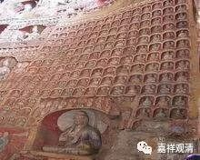

**《微课中观史》18·3**

寂护论师第一次去藏地的时候，受到了来自传统宗教——苯教的压力，就没有开展他的传教活动。后来他又第二次去了藏地——那个时候要称为吐蕃了。去到吐蕃最重要的一件事情就是创立了桑耶寺，或者说参与创建了桑耶寺，然后就为吐蕃的七个贵族弟子剃度。这七个人就是西藏历史上最有名的七觉士，最早在藏地剃度出家的藏人。后来寂护论师在藏地应该还是有过一些活动的，具体的情况不太清楚，有几种不同的说法。一种说法说他回到了印度，一种说法说他最后在藏地去世的，说是摔下来被马踢死的，好像也有说并不是意外死亡。

寂护论师的作品应该蛮多的，比较重要的有《摄真实论》、《中观庄严论》、《中观庄严论疏》、《二谛分别论注》这些。我们在前面讲了，寂护论师是中观自续顺瑜伽行派的一个代表人物。我们现在说他是代表人物，因为在他之前的文献就比较缺乏，所以现在基本上就把他当作是中观自续顺瑜伽行派的开创者。

但是以我们现在汉传佛教的一些“观点”来看，不见得一定是寂护论师开创的，因为在汉传早就有这些说法，说不定在那烂陀寺也早就有了。但是没有相关的文献，我们现在只能说寂护论师就是一个开派的人物。

寂护论师的弟子莲花戒大师也是在藏传佛教史上一个非常有名的人物，我们中国的很多民族主义者看到这个人是有点“吃酸”的——不是很高兴的，为什么呢？因为他跟禅宗有过一次辩论，到现在我们的很多法师还是觉得有点不忿，很为摩诃衍禅师张目。我也看过摩诃衍的作品，和印度这几位大师比起来，水平确实不是很够。

那就稍微介绍一下摩诃衍禅师吧。实际上他这个人物在历史上是有记载的，有人说他是北宗的，禅宗在六祖慧能大师的时候是分南宗和北宗的，有人就说他是北宗的人物。但是看圭峰宗密大师的《禅源都诠》（如果我没记错的话）的记载，摩诃衍禅师应该是南宗北宗的传承都有——现在我们讲传承，就是他有这样的一些老师。当时他在敦煌地区是被称为“敦煌菩萨”的，在敦煌地区他是说了算的，或者相当于佛协主席，还是敦煌地区的长老性质的人物，论学问在敦煌地区确实也可以了。

