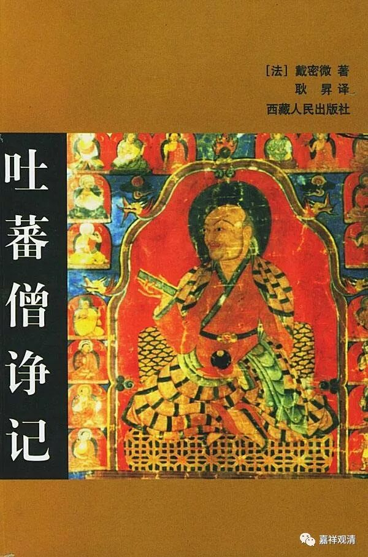

**微课堂佛教史019·1**

今天有点晚了，我们还是要把这个微课堂完成。佛教史，上次是讲到大约在唐朝的鼎盛时期，或者说盛唐时期，西藏就引进了佛教。当时引进佛教的路径有两支，一支是从汉地传入的，以禅宗为主，那个年代也是禅宗初盛的时候。主要传入的不是经论这些，当然也有经论的传入，但不是最主要的。

另外一支就是从印度传入的中观派——中观自续顺瑜伽行派。最先进入藏地的是寂护论师，但是他来了以后受到了苯教的排挤，于是他就请莲花生大师入藏。再以后呢，莲花戒大师也入藏，他也是中观派的一位论师。

这个时候呢，藏王赤松德赞想要让佛教在藏地生根，那么对他来说就要考虑一下，更多地主张和支持哪一派。后来就有了一场比较有名的辩论，叫“吐蕃僧诤”。也有人说叫“拉萨僧诤”比较好，因为是发生在拉萨的一场出家人之间的辩论。

上次我也说过，有一本书叫《吐蕃僧诤记》，法国的戴密微先生写的，好像是在八几年翻译的吧？大家如果有兴趣的话，估计现在网上也有卖，可以去找一下看看，这本书还是不错的，或者说挺好的，内容非常地详细，是这方面的名著。

这场辩论中最重要的两位人物就是代表汉地禅宗的摩诃衍大师和代表印度中观派的莲花戒论师。摩诃衍大师作为禅宗的代表呢，他可以说是有点唯识派的背景的。不过，虽然他也看了不少经论，但是绝对不像印度的那烂陀寺的这些论师们对经典的学习这么严谨，可能打坐的话他还行一点。

另外一位就是莲花戒论师，他是寂护论师或者静命论师的弟子。他的著作对我们来说最熟悉的，或者说长期被大家津津乐道的作品就是《修习次第论》三篇——《修次初篇》、《修次中篇》和《修次下篇》。其中《修次初篇》好像在宋代的时候就翻译成汉文的，《修次中篇》和《修次下篇》现在好像也翻译过来了。《修次下篇》好像有两个翻译版本，都比较白话的，感觉不是很难，大家找机会可以看一看。

