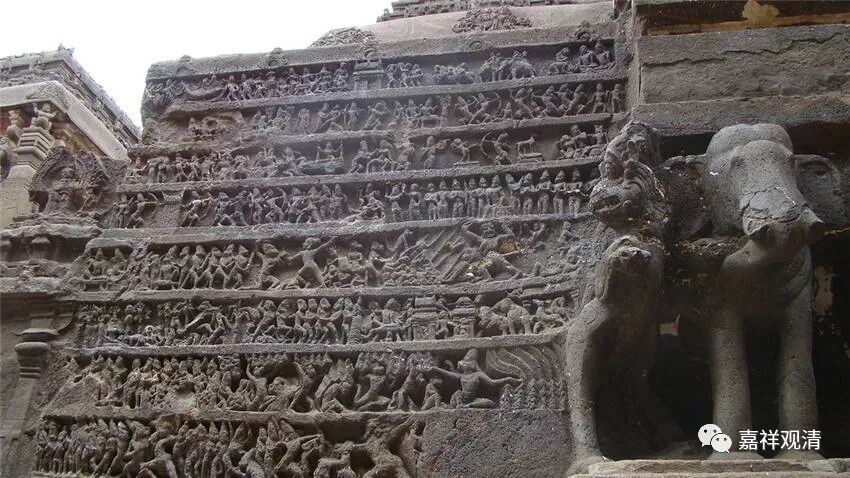

**《善说精髓》084（60）**

既然以“轻安”作为得不得奢摩他的判别条件，那么，什么是轻安呢？，又怎么获得轻安呢？

** “午二、示获圆满轻安已成就奢摩他之理**

** 身心于善无堪能，随所欲转名粗重；”

** 

“粗重”之前，先说“轻安”。

《集论》卷一：

** “何等为安？谓止息身心麁重，身心调畅为体，除遣一切障碍为业。”**

《集论》的意思是：轻安就是能止息“身心麁重”，调畅身心；依次轻安的势力，渐渐能除遣一切障碍。

《成唯识论》卷六说：

** “安谓轻安，远离麁重，调畅身心，堪任为性，对治惛沈，转依为业。谓此伏除能障定法，令所依止转安适故。”**

《成唯识论》说“轻安”有二，有漏的和无漏的，有漏的轻安“能”伏障定法，无漏的轻安能“除”障定法；轻安正对治昏沉，总的则对之一切障定法。

《集论》和《成唯识论》都说轻安能“** 止息身心麁重**”、“远离麁重”，那什么是“粗重”呢？

“** 粗重**”就是：“** 身心于善无堪能随所欲转”。身心在善法上不能够随己所欲地运用。

《菩提道次第广论》说：

**“身心粗重者，谓其身心，于修善行，无有堪能随所欲转。”

若依《瑜伽师地论》，则止息身心粗重者不独轻安，《瑜伽师地论》力“身心粗重”的范围要更宽一些。如《瑜伽师地论》卷二十八：

** “云何止息身心麁重？**

** 谓如有一或由身劳身乏，发身麁重、发心麁重，此因易脱威仪而便止息；

**或由太寻太伺，发身麁重、发心麁重，此因内心寂止方便而便止息；

** 或由心略、心劣、惛沈、睡眠之所缠遶，发身麁重、发心麁重，此因增上慧法毘鉢舍那顺净作意而便止息；

**或由本性烦恼未断，有烦恼品身心麁重未能舍离，此因相续勤修正道而便止息。”

** 

这是说身心粗重有四：

1、太累引起的身心粗重，休息一下就好；

2、想太多引起的身心粗重，修止就好；

3、心太低下、昏沉、睡眠引发的身心粗重，修观对治；

4、烦恼品的身心粗重，勤修断烦恼法止息。

** 

可以看出，依这里的第四种，《成唯识论》说有无漏的“轻安”。

** 

依《瑜伽师地论》这段来看，，则《广论》及此处所说的“身心粗重”，是轻安对治的那部分“身心粗重”，并不是这里的全面的“身心粗重”。

** 

