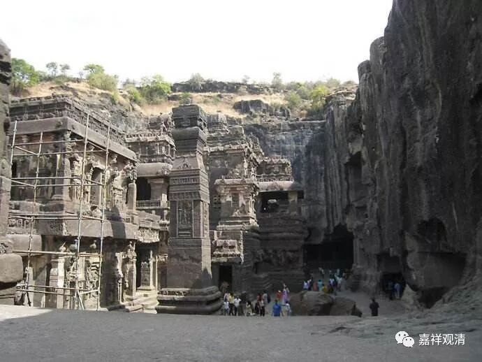

**《微课中观史》19·2**

莲花戒大师的论著还有对《中观庄严论》注释和对《摄真实论》的注释，这两部都是对他的老师寂护论师所写的论著的解释。他还有对《正理滴论》的注释和对《稻秆经》的注释。

中观和唯识对《大乘稻秆经》这部经典都很重视，那么这部经是讲什么的呢？是讲十二缘起的。《大乘稻秆经》是弥勒菩萨请问释迦牟尼佛，然后有了这样一部经典。

莲花戒论师在这场辩论当中是获得了胜利，是赢了大乘和尚的。“摩诃衍”，翻译过来就是大乘，所以汉地的名字叫“大乘和尚”，叫“摩诃衍”的也有，汉地也有这样的说法。那么莲花戒论师和大乘和尚辩论，一般来说都是讲莲花戒论师赢的。现在汉地有些人不承认，说大乘和尚没有输。可是你不承认也没有用，事实就是这样。

我们可以去看看《吐蕃僧诤记》，包括敦煌的一些史料，可以看出来应该算是输了。摩诃衍他自己都放出这样的话来：“经论方面我不是很熟悉，一定要说的话，我到敦煌去找我的一个徒弟，他对经论比较熟悉。”连这种话都放出来了。

所以综合起来看，这场辩论应该是大乘和尚失败了，就是摩诃衍失败了。按照当初制定的规矩，他就相当于退出西藏教区，有传说汉传佛教禅宗的势力很完整地退出西藏的教区，看起来不像，“全部退出”应该只是后期的传说；如果说退出拉萨地区，这是有可能的，以前的行政能力没有今天那么强啦，没办法“贯彻”、“落实”地那么彻底的，核心区域也许可以做到，“边疆地区”很难做到的。我们举个例子好了：唐武宗灭佛，河北一带就没怎么奉旨；而且藏传佛教的很多传统中，明显有汉地禅宗留下的痕迹，甚至大圆满传承早期重要祖师级人物中还有一个汉人……

但是在辩论以后，至少是在大乘和尚失败以后，藏王就主推中观这一系，就是寂护论师和莲花戒论师这一系的中观派。后来就说藏地佛教的义理主要以中观派为主，而且还是藏王专门下了命令的。这是被主流文献记录的。假如说藏传佛教后来以密宗面目被大家记住的话，那各宗在显宗方面基本都自认是中观派，只有极少数人在显宗背景上以唯识师自居。

