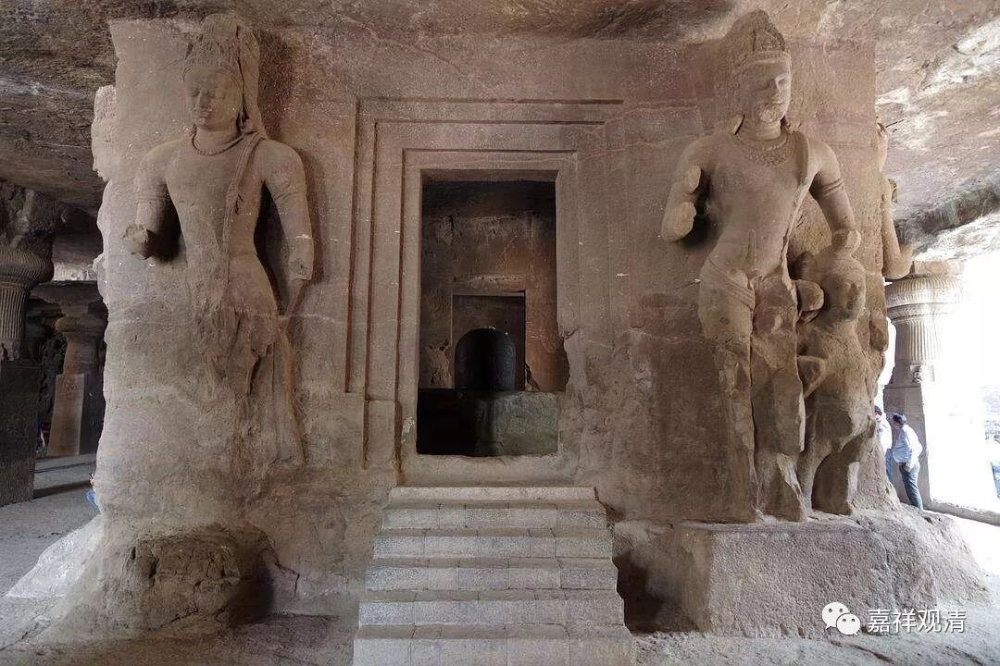

**《善说精髓》084（61）**

** “离此身心于善行，柔如木棉极堪能。

**修此堪能后成就，轻安心一境性止。”

** 

** “离此”**的** “此”**是指的上面所说的身心粗重。离了身心粗重，** “身心于善行”**就** “如”“木棉**”花一样极其调“** 柔”、“极堪能”，“堪能”，**就是有能力随意成办，某种角度堪能就类似于自在。这个时候呢，身体方面轻盈、无倦，心上则不作动摇，远离禅定的诸种过患——失念、睡眠、昏沉、掉举、散乱、不正知。“** 修此堪能**”到了圆满的时候，就成就了“** 轻安、心一境性、止**”。

“** 生輕安兆行者顶，似重然乐等相现，

**心身轻安依次生，** ”

** 

“生”起“轻安”的前“兆”，是最初从此“行者”的头“顶”这个部位，有好“似重”物压下的感觉，但并不是不舒服的，而是一种“乐”触，然后这种感觉慢慢从上而下遍布全身，这些情况出现以后，心轻安、身轻安依次生起。

** “许初是识次为触。”

** 

这里，心轻安是心法，身轻安是色法“触”。“** 许初是识**”，是说心轻安是心法，并不是说它是心王——轻安是心所。严格来说，心所的“轻安”要说“安”，因为“轻重滑涩”的“轻”属于色蕴的“触”——“色声香味触”的触，所以，“心轻安”接下来生起“身轻安”，严格来说应该说“‘心安’以后生起‘身轻’”，不过一般笼统说“心轻安”、“身轻安”大家也都习惯了。

** 

** “此身轻安初生时，虽具身心喜乐受，

**然犹未得相圆满、易了轻安后减退，**

** 扰动其心粗喜乐，不动顺定如影随，

**获此轻安名得止，定地所摄初作意。”

** 

这个** “身轻安”**最** “初生”**起的** “时”**候，** “虽”**然** “具”**备了** “身心喜乐”**的感** “受”，“然”**而仍然** “未”**能获** “得”**众** “相圆满”、“易”**于明** “了”**辨别的** “轻安”。

** 

在** “减退”**了最初** “扰动其心”**的** “粗”**分的** “喜乐”**以后，** “不动”**的** “顺”“定”**心** “如影”**相** “随”，“获”**得如** “此”**圆满的** “轻安”**就是获** “得”**最初的** “止”**，迈入了** “等引地所摄”**的最** “初”**的** “作意”**。

就是在身心轻安后会生起粗的喜乐——依次是，心轻安、身轻安、身轻安乐、心轻安乐，在此踊跃的心安静下来以后，此时的“轻安”是和等引地相符顺的合格的轻安，此时即得最初的止、最初的（世间道的）“作意”——了相作意。

