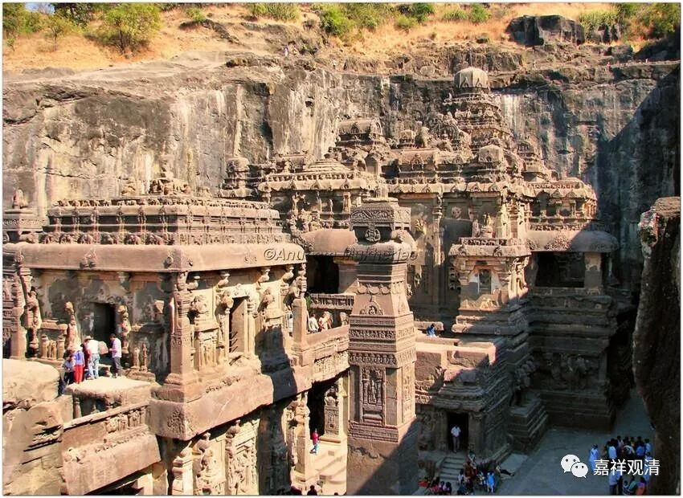

**《微课中观史》19·3**

这个时候，藏地的出家人已经有了，是吧？藏地出家人的出现是在桑耶寺，由寂护论师给他们剃度，就开始有了出家人，也定下来如何去弘扬哪一宗，或者说主要的观点按哪一系来讲，最后就是：翻译或者是传播到西藏的佛经、论典等等的观点，主要按照中观派的来讲，而且也定下了很多很多其他的规矩和一些法令。比如说，四家人家供养一位比丘。

就这样，当时的藏王为了扶持佛教就做了很多这样的事情，进行了很多的改革，由此就触及到了一些社会上层人士的利益和信仰，因为藏地原先的信仰并不是佛教。我们之前也讲过，寂护论师到藏地的时候，一开始也是受到来自苯教的很大的压力，那么这个时候这种情况还是存在的。后来就发生了一次政变，如果我没记错的话，政变的结果应该是赤祖德赞死了吧，还是他死了以后发生的政变？

除此之外还有一个情况就是，关于莲花戒论师的圆寂有几种不同的说法，其中有一个说法就是，他最后是被苯教徒杀掉的，是死在一个苯教徒手上的（极端的一个说法是，他是那什么被捏爆而死的）。寂护论师也有一种说法，说他在藏地的时候，从马上摔下来后圆寂的。所以早期传入藏地的中观派又出现这种意外圆寂的情况（怎么咱中观派的人老是要出点事，大概都喜欢出头）。

那么，寂护论师和莲花戒论师的著作应该是大量地被保留了下来，现在藏地都有很多，也有很多人在慢慢地把它们整理翻译出来，是吧？但是早期的时候，这两位大师的作品只有莲花戒论师的《修次初篇》在宋代的时候被翻译过来，不过也没有引起太多的重视，很可惜啊，好在现在慢慢地开始有这些作品的翻译了。

接下去中观派在这个时代还有几位人物，比如解脱军论师、狮子贤论师等等，这些人是和唯识系统有关的。按照藏传来说，特别以格鲁派的观点来说，他们都是证得中观见的，那么我们就把他们一起放在中观派的历史里面介绍。实际上他们的师承系统应该是唯识系统的，或者说是世亲论师这一系的。

好，今天我们佛教史就先讲到这里，谢谢大家！

