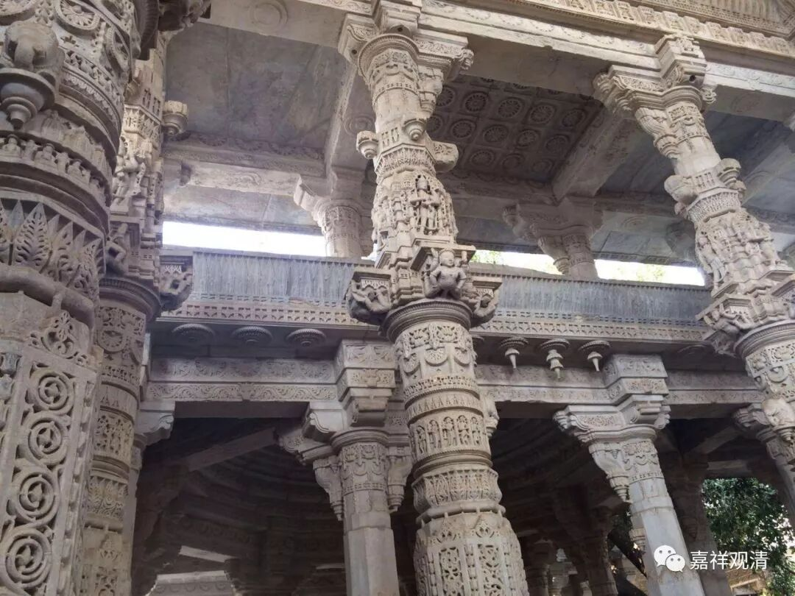

**微课堂佛教史020·1**

现在我们聊聊中观派的佛教史。中观派早期的代表人物是龙树菩萨和圣天菩萨，或者说圣龙树菩萨和圣提婆菩萨。中期主要的几位代表人物就是佛护论师、清辨论师、月称论师和寂天论师。那么后期的代表人物，上次已经先讲了两位——寂护论师，又称静命论师，以及莲花戒论师。

我们突然发现，中观派又出问题了，就是寂护论师和莲花戒论师都去世得比较“突然”，非正常死亡，可能是中观派的斗争性确实太强烈了，也许他们的辩论实在太厉害了，也许他们太有事业心了、太一往无前了。然而，轮回并没有那么讲理……

另一方面呢，寂护论师——静命论师在把佛教传入西藏的时候，西藏原始的宗教——苯教还是挺强大的，所以就发生了比较大的反制。

我们还讲到了另外一件事情，就是莲花戒论师曾经有过一次辩论，是和汉地的摩诃衍大师——又翻译成大乘和尚的，或者他本来就叫大乘和尚——“摩诃衍”就是“大乘”的梵文。历史上把他们之间的这场很大的辩论称为“拉萨僧诤”或者“吐蕃僧诤”。“吐蕃”就是地名，“僧”就是和尚，“诤”就是争论、辩论。

那么这场辩论到底发生在哪里？到底有没有发生过这场辩论？现在普遍的说法是，在拉萨可能有过这样一场辩论，不过倒未见得像后来所讲的“摩诃衍向莲花戒献上花冠认输”这样的事情发生。

现在敦煌的文献当中有一些是保留“拉萨僧诤”这方面的内容，藏地目前通用的说法所依据的文献记载可能稍微晚出乐一点。上次我推荐过，如果对这个事件有兴趣的话，可以看看法国人戴密微教授写的《吐蕃僧诤记》，写得很好，里面的史料也非常完善。

戴密微教授是法国汉学的代表人物，其实他背后还有其他人在帮忙的。当时在法国抄敦煌卷子的一位向达先生，曾经和陈寅恪先生、胡适先生等都有交往的。这位向居士是在法国抄敦煌卷子，也就是做敦煌的学问。他给了戴密微教授有很大的帮助。如果大家想了解这次辩论的话，可以去看一下那本书。

