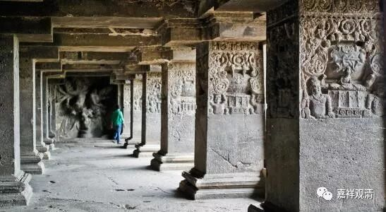

**《善说精髓》084（63）**

** “午一、正说有作意相**

** 得此作意相状者，有力净惑入定时，

**两种轻安速生起，”

** 

最初得到作意、奢摩他有哪些特征呢？

1、** “有”**能** “力”“净惑”**，净除烦恼。这里的净惑可以分二，一种是世间道伏惑，压伏烦恼未断种子；一种是出世间道断除烦恼。

2、“** 入定时两种轻安速生起”**，修禅定的过程中，能够迅速生起身心轻安。也有说能够迅速生起依奢摩他产生的轻安和依毗婆舍那产生的轻安。

** 

** “五盖大多不现行，出定亦具少轻安。”**

** 

3、“** 五盖大多不现行**”，五盖不易现行。五盖就是贪欲盖、嗔恚盖、惛沉睡眠盖、掉举恶作盖和疑盖。在禅定生起的时候，五盖并不是已经断除或者不现行，而是五盖的力量已经很弱，很少生起，生起后力量也不强。

4、“** 出定亦具少轻安**”，出定、下坐后，身心轻安的境界也能延续一段时间。

** 

** “净奢摩他轻安二，互相辗转能增长。”**

** 

5、清“** 净”**的** “奢摩他”**和** “轻安”“二”**者，** “互相”**能得到** “辗转增长”**，轻安能令奢摩他辗转增上，奢摩他增上后又能令轻安辗转增上，就是说开始了一个良性的上升通道。

** 

** “定中粗相悉消除，心者如与虚空合，

**起定获身似新生。”

** 

6、“** 定中粗相悉消除**”，在定中，粗显的行相都不生起；

7、“** 心者如与虚空合”**，禅宗里常说的“心包太虚”，心里有一种空朗朗的感觉。

8、“** 起定获身似新生**”，出定以后觉得像换了个人、换了个身子似的。禅宗的“无位真人”，可能是指的这个感觉。

** 

** “烦恼力弱难持久，住分浓厚极明了，**

** 眠定和合梦清凈。”

9、“**烦恼力弱难持久** ”，前面说“有力净惑”，这里说烦恼现起后自身的力量也很弱了，也难以持久，也就是烦恼薄了，以后可以算“薄尘行者”了。

10、“**住分浓厚极明了** ”，明分、住分的力量也很强。

11、“**眠定和合”：** 睡眠中也常和入定一样。

12、“**梦清凈”：梦中也很清净、有吉祥、清净的梦境。

