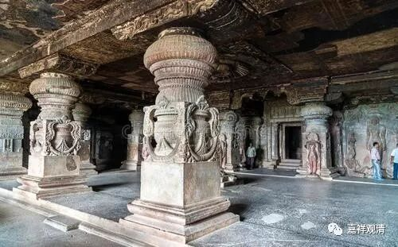

**《微课中观史》20·2**

从《吐蕃僧诤记》或者现成的史料中来看，大乘和尚确实不是莲花戒论师的对手，完全不是。至少在经论方面，他们对经典的熟悉程度和学习能力，不是一个等级的。如果从文字上来看，那是败得很惨。当然，你也可以说大乘和尚主要是禅修的，或者对印度的辩论格式不是很熟悉，这也是一种历史的说法。

在西藏的说法中，大乘和尚后来就让出西藏的教区，但实际上这种可能性是没有的，最多就是他不在拉萨传教了。但是有一点确实是可以肯定的，皇家的福祉因此就给到了莲花戒大师这一系。皇家就是赤松德赞，在前期是赤德祖赞，后期是赤松德赞，他们在弘扬佛教的时候，既然有了“拉萨僧诤”的胜利，肯定就大大倾向莲花戒论师。我忘了是传说还是记载，就是在莲花戒论师得胜以后，在西藏当时已经有一批信禅宗的人，就很伤心，好像也有自杀的情况（有的自杀的方式也很刚烈）。这也从哪个一个侧面说明当时禅宗在西藏得到了非常广大的弘扬。

这个呢，禅宗后人是不太认的，推说摩诃衍大师是北宗的。但是现在看来，摩诃衍大师在北宗和南宗的传承都有，其实他主要是南宗慧能大师这一系的传承，也兼济北宗的传承。摩诃衍大师主要的背景是菏泽神会大师门下的，如果我没记错的话，摩诃衍大师应该直接就是菏泽神会大师门下的，神会大师当时也是为六祖大师争地位的人嘛，被朝廷封为七祖。

要说禅宗完全退出西藏，这是不太可能、不太现实的。因为在当时虽然说西藏接近于一个王朝——吐蕃王朝，但是他们对边疆地区或者下属其他部落地方的控制，特别是宗教的控制，应该也没有那么严格，管辖能力应该没有那么强。现在我们也可以在藏区看到一些其他的教派，比如宁玛派、噶举派中，有一些和禅宗很接近的内容。据一些考证，这当中的确有禅宗的影响。

我们可以说，从敦煌传入的禅宗也许退出了，或者说拉萨是在政治核心的地域，中观派就得到了很大力的扶持。藏王甚至下了命令说，印度佛教的观点主要以中观宗为主，或者主要以中观宗来判，所以藏人对中观宗还是比较认可的，懂不懂的都说自己是中观派。

但是，其实西藏还有一支从四川传入的禅宗派系。我们前面讲摩诃衍大师或者大乘和尚，是属于南宗当中的六祖大师的再传弟子——菏泽神会大师是六祖大师的弟子，而摩诃衍大师则是菏泽神会大师的弟子。但是，禅宗可不是只有这一支，还有一支在四川的，叫保唐宗。保唐宗好像是从五祖大师下面传出来的，这一支本来就在四川成都那一带传播。所以，保唐宗这一系的禅宗对西藏的佛教也有影响。

