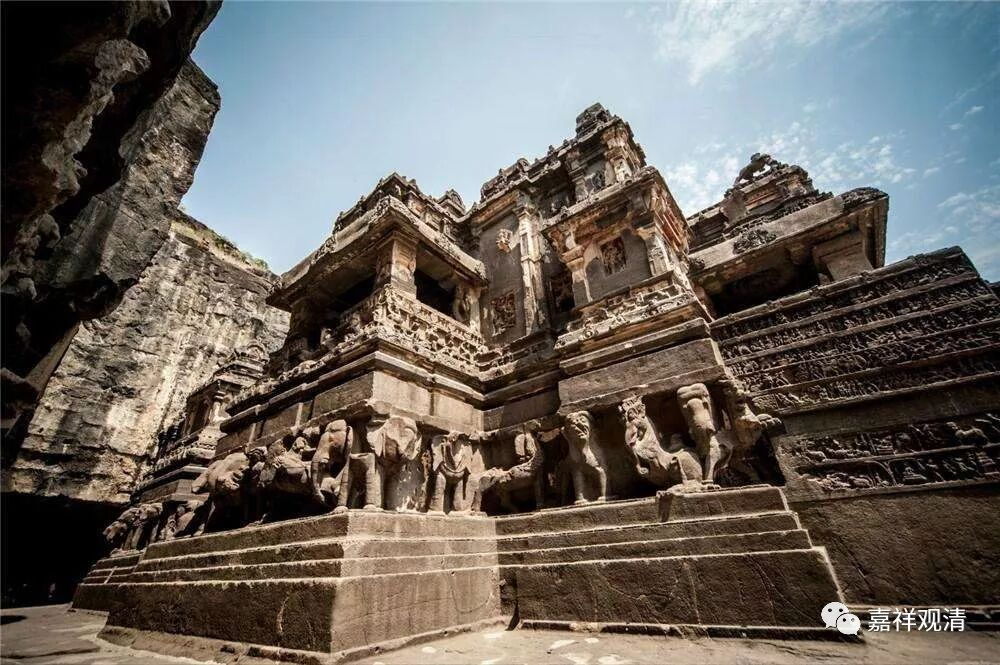

**《微课中观史》20·3**

现在讲起来禅宗不太可能是一刀切地退出西藏，这个可能性很小。而且，现在大圆满的传承当中，还明确地说在宋代的时候专门有过一个汉人。但是这个人在汉传的历史上就没找到过，只是在藏地的大圆满传承中是承认这个人的。我专门去找过，也没有找到这个人在汉传佛教史料方面的任何记载。但是在藏传佛教的宁玛派，在他们的祖师当中，对这个人是非常推崇的，承认历史上有这么一个汉人。

现在也有很多汉人学了藏传佛教宁玛派，说和禅宗很像，也有藏地的人跑到汉地来说禅宗比较接近密宗。我们且不说他们这两种人看到的东西到底是不是对方的精粹，但是确实可以发现，宁玛、噶举的有些东西和汉地地禅宗有很多类似的地方。当然也有一种可能性（我们确实不能说只有一种可能性），就是这两个宗派各自发展出这种类似的内容——这种可能性不是没有，但是我们确实可以从一些流传或者考古中印证，或者直接推论到：保唐宗或者禅宗对藏区的影响不会全部消失。保唐宗对于目前的四川或者西康这一带的地域比较接近，应该会有影响，而且确实有些考证指出藏传佛教中有这些背景。

摩诃衍大师后来就回到了敦煌，再以后关于他的传记并不多丰富。在敦煌的文献当中可以找到几篇史料，好像是《顿悟大乘正理决》和《大乘二十二问》这些。在敦煌有一些关于“吐蕃僧诤”的史料，从我所接触到的文献看下来，很明显大乘和尚他是输的，即使他输得口不服，但是我们看起来，他应该至少承认过失败。系统的经论教育和对经典的掌握程度，禅宗门下和印度的文化精英相比相差得还是蛮大的。

和大乘和尚辩论的对手或者说敌方，是谁呢？就是莲花戒论师。现在有些汉传的法师，主要是出于民族自尊心的缘故，都在为大乘和尚争地位，有的写的文章前言不搭后语。前面一页说大乘和尚说错了，隔了两页又说大乘和尚的东西是为利根的人所讲的——这种莫名其妙、自相矛盾的话。如果前后文放在一起看的话，就变成“说错的这种教法是为了利根的人讲的，而说对的教法是为了钝根人讲的”——这种说法也太莫名其妙了。背景主要是基于民族自尊心，觉得汉人不能输给藏人，禅宗不能输给学经论的人。其实呢，说这话、写这书的人自己的经论水平就够呛（不过弟子多的人一般就没有这种自省能力了）。

大家如果有兴趣的话，可以去看一下《吐蕃僧诤记》，里面也有一些关于历史方面的其他内容。

如果我们再从历史的角度来看“吐蕃僧诤”这件事，就发现这事儿有点“吊诡”了。假如元末明初之际没有宗喀巴出世，那么，历史其实选择的是摩诃衍，即使当时他辩论输了——除了格鲁系统以外，藏区其他教派几乎都是倾向于摩诃衍所表述的那种“无分别”的。

