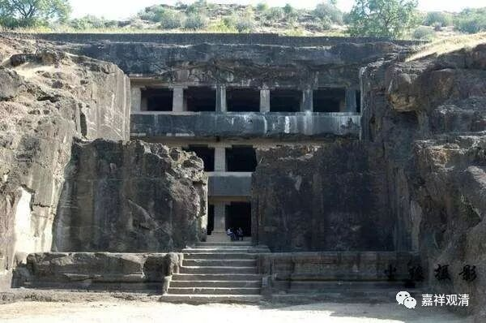

**《善说精髓》084（65）**

** “辰二、总示依奢摩他趣道之理**

** 外内二与内道之，三乘一切瑜伽师，**

** 断惑现行与种子，粗静行相十八界，**

** 了相与谛行相等，一切胜观初皆须，

**依此而成故此止，说是近分未到定。

** 具粗静相胜观者，于内道非不可少，

**外道则无谛等观。无上部于生次时，**

** 须成就止然不必，为生粗静行相观。”

总的来说，此轻安乐生起之时，就是最初的奢摩他，同时也迈入最初的作意、最初的定；这是初禅的近分定，被称为“初禅未到地定”。

在此未到地定的基础上，有两个进路：一，观上界的“净、妙、离”下界的“粗、苦、障”，以欣厌相修世间禅。如最初观察初禅的“净、妙、离”欲界的“粗、苦、障”渐起“了相作意”等七种作意，最后的生起的“加行究竟果作意”就是获得初禅；继而，观察二禅的“净、妙、离”初禅的“粗、苦、障”渐起“了相作意”等七种作意，最后的生起的“加行究竟果作意”就获得二禅……依此最上可修得“非想非非想定”，但此时仍旧是世间禅，可以世间道住心的力量“伏”烦恼令不现行，但不能断除烦恼。

二，依初禅未到地定，专修出世间毗婆舍那，或以四谛十六行相等（声闻行者）、或依各宗所许空正见等为分别的对象，在出离心或者菩提心的摄持下，以最初“了相作意”等七作意循序渐进，至其“加行究竟果作意”，此时，若依声闻道，则证初果，若依一向大乘道，则证大乘见道位初地，如此渐趋而至大小乘无学果位。此种进修，非仅不令烦恼现行，亦能断烦恼种子，故立为解脱道、出世间道。

这两种进路，都依同一个基础“初禅未到地定”（出世间道不是必须依初禅未到地定修，但最下也要依此定来修），所以，这个初禅的近分定（或者叫未到地定、也是最初生起轻安乐的状态、最初获得的真实奢摩他）是内外道的共法，不是内道的不共法，也不是解脱法，单纯此定也不能安立为任何解脱道或者出世间道。

实际的修行路上，很多人把这种最初的禅定境界当作证悟，以此为解脱，在佛教初期的时候、佛陀时代，就有人把证得四禅当作证得四果，佛教里说这叫“增上慢人”。乃至后来很多人把禅定的“乐、明、无念、无分别、空（朗朗）、能所双亡”当作了证果，自以为已成佛做祖，这种情况在禅宗里有，在密宗里也有，究其原因，还是“不学无术”。其实如果老实点、正知力强反省一下看看就能够知道：自己的烦恼未减、智慧未生，哪里来的解脱哦！教理上连凡夫都不如的“佛”，也只能存在在文盲的现实里。

