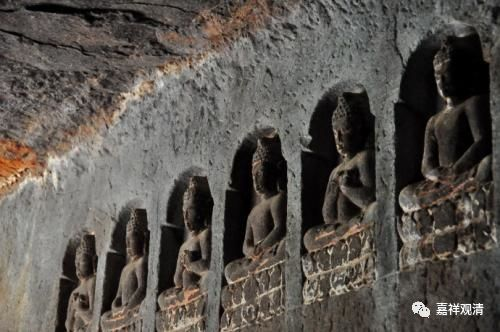

**微课堂佛教史 021·1**

我们继续佛教史。

我忽然发觉上一次我偏题蛮厉害的，因为现在应该是讲印度的中观宗历史，结果我讲着讲着，就讲到西藏去了。当然，这也算是关于莲花戒论师的一个比较重要的事件吧。莲花戒论师在印度的一些历史，其实不是很清楚，只知道他的老师是寂护论师，是吧？那么，他主要的活动地域应该还是在藏地，所以就讲了这个故事，大家有兴趣的话可以自己再去看一下。

关于莲花戒论师的圆寂，也有几种说法，其中一种说法说他是在藏地遇难的——这种可能性还真是有的。那么他是赤松德赞这个时代的，在赤松德赞后面呢，就出现了朗达玛灭佛的事件，是吧？这个事情我们就不讲了，等到以后讲西藏佛教史的时候我们再讲。

我们接下去再介绍一些这个时代的中观派人物，或者说是在传统当中认为这个时代持中观见的人物，比较主要的人物就是解脱军论师和狮子贤论师。这两位的传记也不是很清楚，我们知道的就是解脱军论师是狮子贤论师的老师，他著有对《现观庄严论》的注疏。

传统上说，解脱军和圣解脱军是两个人，但据XB仁波切观察，这可能是同一个人不同时期的名号略异而已。所以这里也暂时把解脱军和圣解脱军当作一个人来看吧。

狮子贤论师也有对《现观庄严论》的注疏。这两部作品，一个本子比较短一点，一个本子比较长一点。那个比较短一点的，是狮子贤论师的《现观庄严论注疏》，通常被称为“小注”。

现在好像《现观庄严论疏》已经有很多的版本了，大概至少有四个版本，说不定有五个版本，马上可能还会有第六个版本。因为狮子贤论师的这部《现观庄严论疏》是比较重要的，其他的注疏基本上都是在他的这部作品的基础上来广解的。民国的时候好像翻译过几个版本，台湾好像也翻译过一个版本。我以前曾经碰到过一位五台山的出家人，他也翻译过一个版本，名字我忘了。那么，这部注疏是比较重要的。

关于这两位——狮子贤论师和解脱军论师的传记，不算很了解，藏地有没有其他的说法也不知道，一般好像也不是很清楚。

