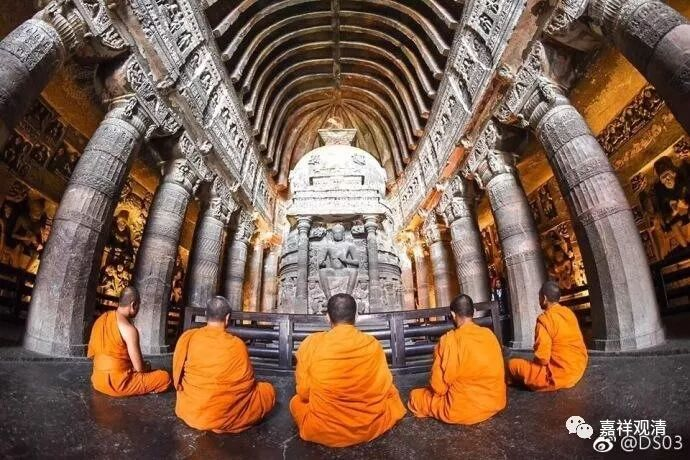

**《善说精髓》084（66）**

** “外内二与内道之，三乘一切瑜伽师，”**

** 

修禅定的呢，有** “外”**道和** “内”**道** “二”**类行者，** “内道之”**中的声闻、缘觉、大乘之** “一切瑜伽师”、**修行者，都是想要达到各自的解脱的。

** “断惑现行与种子，”

** 

他们“** 断惑”**的** “现行与种子**”：部分外道行者，修世间的禅定，以此为解脱，他们能依禅定压伏烦恼令不现行，但并不能断烦恼的种子，内道则能以出世间道断烦恼的种子令永灭。

** 

** “粗静行相十八界，了相与谛行相等”

** 

外道行者，则只能以三界九地欣上厌下的方式，厌弃下界的** “粗”**的行相、欣乐上界的** “静行相”**来伏烦恼；内道则依自宗观修** “十八界”**等，** “了”**其行** “相”**；或者观察四“谛”十六“行相”、观真如空性“等”来断烦恼。

** “一切胜观初皆须，依此而成故此止，

**说是近分未到定。”

如上种种内外道的“** 一切胜观**”、毗婆舍那，最“** 初皆须依此”**奢摩他** “而成”。就是说一切内外道的胜观、如量的毗婆舍那，都需要在此奢摩他生起以后才能建立。“**故此止

** 说是近分未到定”，**这也就是初禅的** “近分定”**——初禅** “未到地定”。**

** “具粗静相胜观者，于内道非不可少，”

虽然主流佛教部派比如有部、上座部等推荐先修四禅等，但这类“**具粗静相** ”的“**胜观”，** 并不是内道必须要修的，你甚至可以跳过的，所以单纯的修禅定“**于内道非不可少** ”。

**“外道则无谛等观。”**

反过来，** “外道则无”**内道的缘四** “谛”**十六行相、空性** “等”“观”**察修法。

** “无上部于生次时，须成就止然不必，

**为生粗静行相观。”

乃至** “无上”**瑜伽** “部”“于”**修** “生”**起** “次”**第时，也“** 须成就**”初禅近分定的这个“止”，“然”而，在这里成就这个止的目的“** 不”**是** “必**”然** “为”**了** “生”**起** “粗静行相观**”。其实这个和前面内道的部分一样，不是一定要修四禅八定的。

这里要不要修四禅八定，就内道而言大概可以这样说：内道声闻行者，可以修四禅八定，也可以不修；菩萨行者（显宗）单纯证果可以不修（推荐修），但欲证佛果必须要修；无上瑜伽生起次第是可以不修（推荐不修）。

但不论以上修哪一类，都必须要以前述的奢摩他、最初的作意、最初的身心轻安乐为基础。所以呢，很多人“死”在这个轻安乐上，是不明白内外道修行的路径而导致的错误。

