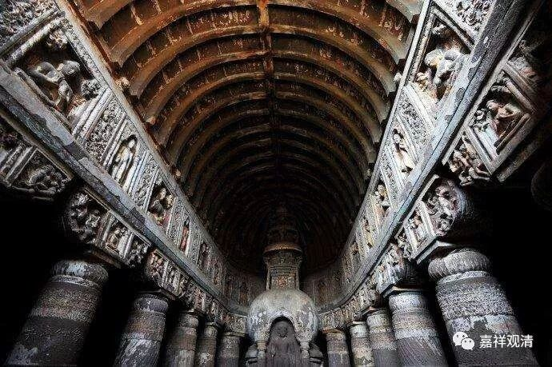

**《微课中观史》21·2**

再往后就差不多到阿底侠尊者的时代了，那个时代也有几位人物的。在阿底侠尊者的传记当中会提到大杜鹃论师和小杜鹃论师，是吧？其实他们的时代和月称论师的时代是差了很远很远的，但藏地传说他们是月称论师的弟子……如果一定要说他们是月称论师的弟子的话，应该是远宗月称论师吧？他们自己应该有他们的老师，只是这中间的传承我们不清楚而已。这两位论师的传记也是不很清楚的。

再就是菩提贤论师，也有翻译成觉贤论师的，他也是阿底侠尊者的老师。他有一些著作，其中之一就是以前我们提到过的《智心要集论》的注疏。菩提贤论师的这部《智心要集论》的注疏，任老曾经翻译过的。《智心要集论》传说是《百论》的作者圣天论师写的，不过现在看起来，也可能就是菩提贤的作品……这个我们可以先打个问号，再慢慢地研究吧，反正对一般人来说，内容比较重要，作者嘛，没那么重要。

那个时代还有一些其他人，比如像胜敌论师、般若金刚论师这些，好像现在对他们到底是自续派还是应成派，也有不同的说法。基本上都是因为阿底侠尊者的传记，然后他的这些老师的名字就都留下来了，对他们的师承也不是很了解。关于历史呢，大概除了中国这么疯狂地崇拜精确的历史，中古时期的其他国家的历史记载好像都不怎么丰富……那么，中国以前的这种热衷历史记载好像也有点问题……近代的印度另外再说，算是记载还比较多一点，那是英国人教会他们的。

总的来看，这个时代因为唯识和中观都有发展，所以唯识和中观的调和性的观点比较多。我们现在由于中观应成派受到了注意，所以大家好像都觉得阿底侠尊者的老师们应该是中观应成派的。克实来讲，那个时代实际上是处于中观自续派或者是中观派和唯识派之间的，我们现在来看的话，应该是中观自续顺瑜伽行派的观点占主流的。

因为宗喀巴大师决择了以后，我们好像觉得那个时代是月称论师的观点占主流，但实际上恐怕是中观和唯识的中间观点占主流。他们在胜义谛上就按中观来讲，讲一切法胜义无，但是在世俗谛上按唯识来讲的，讲唯识无境。假如以这个角度来看，或者以宗义书的角度来看，这个要算作中观自续顺瑜伽行派。

其实现实的宗派远比教科书里的复杂，汉地的一些唯识师，比如说王恩洋先生，就文字上来看，他的观点好像是比较倾向于胜义无而世俗有的。这时候如果按照藏传宗义书的观点，他就变成中观自续顺瑜伽行派了，但是以他本人来说，他肯定认为自己是唯识派的。所以，算哪个派，也许还要看他自己怎么认吧。

当然，这只是个别的事件。现在基本上就说，阿底侠尊者是中观应成派的传承祖师，他的老师大杜鹃论师和小杜鹃论师都是中观应成派的——有这样一个说法。

