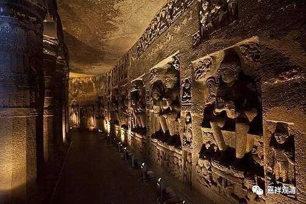

**《善说精髓》084（67）**

** “辰三、别说趣世间道之理**

** 九住心至作意前，是名作意初修业；

**从得作意至了相，名净烦恼初修业，

** 《声闻地》说、初近分，次为了相非同时。

**若许同时证彼二，止前无须止住修，

** 近分之前已有止。”

这里科判是“**别说趣世间道之理** ”，实际内容并没有在“**别说趣世间道** ”方面展开，而是又在辨析和断除一些误解。

首先说：第九住心虽然已经是无功用地任运平等，但仍不是最初的奢摩他，要等到生起身心轻安乐以后，才是最初的奢靡他、最初的作意。那么，在生起了第**“九住心”** 之后直**“至”** 生起最初的**“作意”** 之**“前”** 叫什么呢？“**是名作意初修业** ”，这里有个名字，是《瑜伽师地论》给的叫“**是名作意初修业** ”。

再有一个要说的，在最初得奢摩他、作意以后，此时尚是止观的止。而前述的七种作意（了相作意、胜解作意、远离作意、摄乐作意、观察作意、加行究竟作意、加行究竟果作意），不论是世间道还是出世间道，都属于毗婆舍那部分，那么，**“从”** 最初**“得”** 奢摩他、最初的**“作意”** （最初获得奢摩他和最初获得作意是同时的）直**“至”** 生起七种作意的**“了相”** 作意之间，这个叫什么呢？这个时段，“**名** ”为“**净烦恼初修业** ”。这也见于《瑜伽师地论》。（《瑜伽师地论》真是个百科全书啊！）

《瑜伽师地论》卷二十三：

**“云何初修业瑜伽师？谓有二种初修业者：一、于作意初修业者；二净烦恼初修业者。**

** 云何于作意初修业者？谓初修业补特伽罗安住一缘，勤修作意，乃至未得所修作意。未能触证心一境性。**

** 云何净烦恼初修业者？谓已证得所修作意，于诸烦恼欲净其心，发起摄受正勤，修习了相作意，名净烦恼初修业者。”

** 

这里的“净烦恼”，是包括了世间道的伏烦恼和出世间道的断烦恼。

《广论》所说全引《瑜伽师地论》之文，但似乎对这段文字，格鲁系统还有不同的理解……

