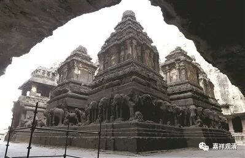

**《微课中观史》21·3**

阿底侠尊者的传记大家知道的也比较多，我就稍微提一下。他原先是一个王族，后来出家了。之前在王族的时候学问也很好，出家以后学问也非常好，很负盛名，之后就成为类似印度的国宝。再以后，说得过分一点的话，就是被藏地的几个译师给骗到了西藏。

然后呢，在阿里呆了几年，大概三年左右，在准备回印度的途中，正好碰到战乱。那个时候就是穆斯林入侵印度，而且这次是入侵成功的。那么，阿底侠尊者在路上碰到战乱以后，就回不去印度了，最后留在了西藏，然后又去了拉萨，带了很多弟子出来。

应该说，阿底侠尊者到了西藏以后，西藏佛教的风格为之一变。如果要说道次第的传统，就是从阿底侠尊者的背景下传出来的，也是非常的朴实。可以说，阿底侠尊者刚去的时候，西藏的“佛教”是有点混乱的，甚至内外道不分的，不分敌我，甚至把杀人和男女当作修行的情况都有。阿底侠尊者到了藏地以后，以他严谨的学识和长老之风、朴实之风影响了西藏的佛教，可以说是学风为之一变。他的随行者后来就开出了噶当这一派，就是“噶”“当”派——一切佛语皆为教授。

后来的格鲁派实际上很大程度上是继承了噶当派的这些内容，特别是在显教方面，对于道次第和经论的学习都非常地注重。当然，格鲁派后来兴起，也有其他的背景。

现在一般来说，都认为阿底侠尊者是持中观应成的观点。在他的传记当中也提过好几次，他对月称论师是非常地关注，给予赞叹，他的弟子仲敦巴尊者在夸奖月称论师的时候，他也极力地夸奖。但是，从阿底侠尊者的老师们来看，他的老师大部分是属于中观自续派的，甚至还有唯识派的，因为那个时候是主流。其实，月称论师的学派并没有特别地在那个时代成为主流，如果是的话，应该有很多人物和著作流传啊。当然，阿底峡在学习的时候主要是以中观系统来学习的，其实他还学了很多部派佛教的内容。

实际上那个时候的印度并没有“自续”和“应成”两派的说法，从这个角度来看，宗喀巴大师真的非常了不起，总结了以前的善说。印度的历史很麻烦的一点，就是它自己没什么历史记载的，所以它的历史基本上要从中国的记载再反推过去，所以印度中观派后期的历史基本上要用西藏的佛教史来给它重建了。

好，那今天先聊到这里。印度晚期的历史大概也就讲到这么多了吧，中观派也就可以先告一段落。要不明天我再想想还有什么要讲的，今天先到这里，谢谢大家。

