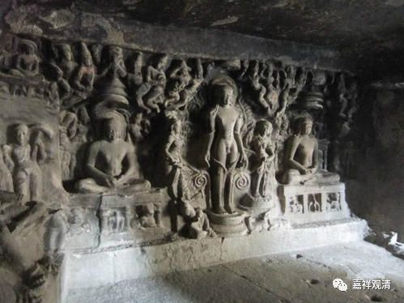

**《善说精髓》084（68）**

我们理一下《善说精髓》所说的从九住心到七种作意的次第：

九住心——** 于作意初修业者——初获奢摩他（最初获得作意、初禅近分定）——净烦恼初修业者（初获毗婆舍那）——了相作意——胜解作意——**远离作意、摄乐作意、观察作意、加行究竟作意、加行究竟果作意。

但就这段而言，格鲁系统的其他教材可能至少还有两种说法：

1、九住心——** 初修业者作意——最初获得奢摩他（最初获得作意、初禅近分定）——仅初修业作意——了相作意——仅净烦恼初修业者作意——胜解作意——**远离作意、摄乐作意、观察作意、加行究竟作意、加行究竟果作意。

2、九住心——** 初修业者作意——最初奢摩他（最初获得作意、初禅近分定）——了相作意（净烦恼初修业者作意）——胜解作意（初获毗婆舍那）——**远离作意、摄乐作意、观察作意、加行究竟作意、加行究竟果作意。

这段还不是很清楚，先“留此存照”，接下来还需要仔细研究，在这里就先不展开了。

** “《声闻地》说、初近分，次为了相非同时。”**

** 

《瑜伽师地论·“** 声闻地》说**”，最** “初”**的** “近分”**定，其** “次”**才** “为”“了相”**作意，近分定和了相作意“** 非**”是** “同时”**生起。

** 

上面说了，最初的近分定，和最初的奢摩他、最初的作意是同时，这一点，上面三种解读的任何一种解读都没有异议。也就是说，和“最初的近分定”同时的“最初的作意”，不是“七种作意”里的最初的“了相作意”。

** 

** “若许同时证彼二，止前无须止住修，

**近分之前已有止。”

** 

** “若”**是认可、承** “许”**了“** 证彼二”**者（最初的奢摩他、了相作意）为** “同时”**，则有两个困难无法解释：

一、“** 止前无须止住修**”。假如“最初的近分定”和“了相作意”同时生起，由于“了相作意”属于毗婆舍那观察修，“最初的近分定”则属于奢摩他，那么，在获得奢摩他之前不一定需要止住修了，因为那样将成为观察修也能生起最初的奢摩他了。“毗婆舍那也能生起最初的奢摩他”——这种说法显然和“毗婆舍那在奢摩他之后生起”矛盾了。

二、“** 近分之前已有止”：**假如认同“最初的近分定”和“了相作意”同时生起，“了相作意”属于毗婆舍那观察修，而毗婆舍那之前应该先要成就奢摩他，那就是说，你得同意“在成就最初的奢摩他之前要先成就奢摩他”这种荒谬的说法了。

