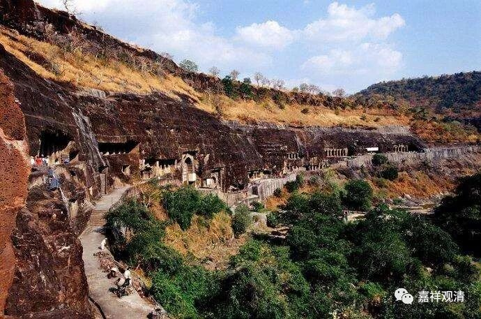

微课堂佛教史022·1

我们继续佛教史。

印度中观派的历史已经讲完了，因为阿底侠尊者之后中观派的历史在印度就不容易找到了，是什么原因呢？因为阿底侠尊者到达藏地以后，我们讲过一个事情，就是他在准备回印度的路上碰到了战乱，就回不去印度了。什么战乱呢？那个时候还没有伊斯兰国，就是伊斯兰教入侵印度。

其实伊斯兰教入侵印度这件事情很早以前就开始了，但是西北印度一直有一个比较强盛的邦国，而伊斯兰教入侵印度一定要走西北印度这个必经之路。印度这个国家基本上是割据政权，那么以前呢，在西北印度的这个地方是有一个比较强大的邦国，所以穆斯林的几次入侵都被挡住了。

差不多到了公元十一世纪、十二世纪的时候，就出现了一些其他状况，西北印度的这个国家就没那么强盛了。这时候又出现了伊斯兰教的国家——原教旨主义的国家，在向整个南亚挺进，就对当时印度的文化造成极大的破坏。

当时的佛教呢——我们一直讲到这个问题，主要集中在几个重要的大寺院，就是我们在藏传佛教中经常听说的印度佛教晚期的那几个重要的寺院。一个是那烂陀寺，一个是大菩提寺。这些寺院，基本上相当于一个大型的学校，这里面其实不仅仅有学佛教的，也不仅仅有学大乘的，可以说什么人都有，学什么的都有，如果印度有武术的话，那寺院里也会有的（泰国的泰拳以前也是在寺院里教的）。

穆斯林入侵后，他们就觉得对付佛教比较轻松了，因为这些寺院是佛教的堡垒，他们甚至把它当作城市来攻打。然后呢，穆斯林就把这几个寺院门一守。按照传说呢，穆斯林武士就是直接逼你选择，或者是信仰，或者是命，那么很多佛教徒选择了信仰呢，就没命了。这样一来，佛教的顶尖高手基本上就被消灭掉了。

藏地有这样一个传说，说穆斯林大军打进来的时候，和尚们都逃了。逃的时候还有个笑话——我们也就听听看，逃着逃着就发现：“哎，怎么护法神——玛哈嘎拉也跟着我们跑了？护法神你应该留着保卫佛教啊！”玛哈嘎拉就说：“你们都跑了，我还留着干嘛？”所以护法也跑了，其实这也挺好。这只是一个小故事吧。

当然上述是比较故事化、简单化，实际应该要复杂得多，既用了大刀长矛，也用了税收、经济政策……总之，佛教在此以后就在印度突然绝迹了。

