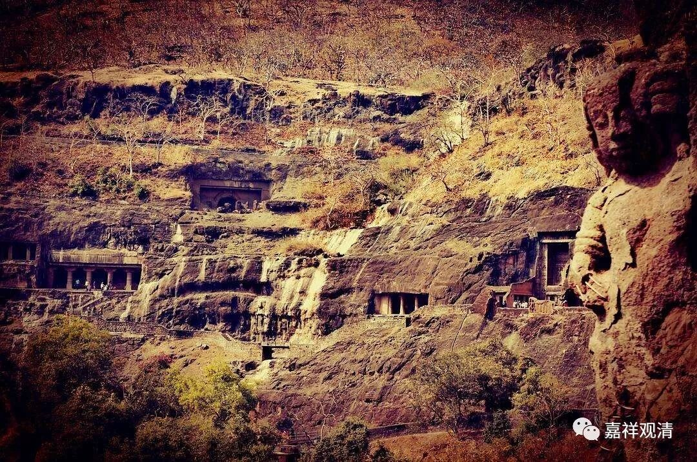

**《善说精髓》084（69）**

** “决定趣入静虑波罗蜜多体性奢摩他之门说讫。”**

奢摩他部分就先谈到这里了。下面是烧脑的毗婆舍那。由于自宗是中观，所以这里的毗婆舍那是按照中观的套路来谈的。

** 

** “学毗钵舍那之理

**寅二、学毗钵舍那之理

** 分四：卯一、依止毗钵舍那资粮，卯二、毗钵舍那之差别，卯三、修习毗钵舍那之理，卯四、修成毗钵舍那之量。**

** 卯一、依止毗钵舍那资粮

**分二：辰一、总示依止毗钵舍那资粮，辰二、别明抉择正见。”

** 

** 辰一、总示依止毗钵舍那资粮**

** 听闻龙猛提婆等，具量论典及解释，

**以辨了不了义慧，抉择正见者即是，**

** 决定胜观因资粮。是故佛护月称论，**

** 立为根本此涵盖，妙论所诠诸深要！

** **

学毗婆舍那的资粮，说起来，积资净障、祈祷加持这些都是，但直接相关的就是学习相应的教授、教典了。

在具格的师父面前，“** 听闻龙猛、提婆等**”大论师的“** 具量论典及解释”**。

这是道次第的最后部分，已经暗含了师父是具足十德的善知识了，所以不再多强调。学毗婆舍那的条件，直接的还是相关内容的学习，但江湖上大量的蠢人梦想着不用学习单靠崇拜师父就可以得到，说起来就是不老实，想偷懒。你就是做到“如理依止善知识”了，善知识在这个地方还是得教你学习相应的教典以通达密义啊！善知识又不像你一样蠢，只喜欢奴才。不然善知识的“具慧、见真、善说”这些德相是做摆设的吗？

龙树、圣天以及佛护、月称、寂天等人的论著和解释是在学习毗婆舍那的时候应该多学习的。乃至宗喀巴大师，你说他事实也好实现也好，他也是在积资净障以后在阅读《中论佛护释》的时候通达的空性，榜样就应该学习啊。

在学习相应的教典以后，** “以”**能够** “辨别”“了不了义”**的智** “慧”，**来** “抉择正见”**，这** “即是”“决定胜观”**的** “因”、“资粮”。

**“是故”** 因此，要把**“佛护、月称”** 等大论师的**“论”** 典，**“立为根本”** 的核心观点来研习。这一点很重要，有些人看到书就读，不辨精粗，那就是学再多也没什么大用，要先立一个根本。

** 

** “此涵盖，妙论所诠诸深要！”**

** 

这涵盖了诸多妙论的内容、抉择了其中的甚深精要。

