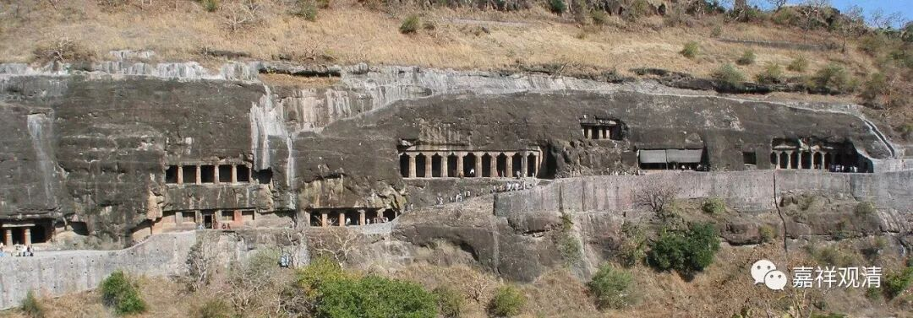

**《微课中观史》22·2**

我们讲过，阿底侠尊者进到藏地以后，他不是就回不去印度了嘛。那么，自从战争开始呢，这条路就不通了。在此之后，穆斯林就入侵了南亚次大陆，进入了整个印度。我们上次也讲过，当时的印度不是今天的一个国家的概念，更多的是一个地理的概念。以前的印度一般来说是比较分裂的，他们在历史上没有出现过一个真正的大的统一全印度的王朝，它真的出现一个大的国家反倒是现在。当然，以前的阿富汗、现在的巴基斯坦、孟加拉等等，都是广义的“印度”地域。而现在的“印度”更像是一个国家的概念——近现代的国家的概念。

当时的穆斯林进入到了印度以后呢，对这些宗教的上层人士就基本采取杀的策略，这个情况大家现在也看到了。那么对于下层的人呢，也不能全部杀光，总得有人干活，怎么办呢？他们就采用收税的方式。

我举个例子——这个例子不是真的，但是差不多就这个意思。比如说，假如你同意改宗，改宗什么呢？改宗伊斯兰教的话，每年收税就5%。假如你不改宗，仍然信佛教或其他印度教等等，他们也不杀你，就每年收税50%，这样时间一长，你就做不到了嘛。

就是说，穆斯林于对印度佛教的上层使用棒子，对于下层则使用经济等等的方式来改变他们的信仰。所以基本上到了公元十二世纪以后，印度已经没什么佛教了，或者说没佛教也可以。

这里我们再说一个很有趣的事情，其实我一直不相信这个事情，是什么事情呢？据说宗喀巴大师在跟南喀坚赞——虚空幢大师学习道次第和一些其他的教法以后呢，准备再去印度学习佛教。后来就有佛菩萨对他说：“如果你去印度的话，你是没有问题的，但你的弟子会死很多，因为他们受不了那里的气候。”这个故事的真实性我一直很怀疑，觉得不太可能——因为那个时候印度已经没有佛教了。

再以后呢，阿底侠尊者的弟子就主要以藏人为主，那么在藏地的噶当派当中就有这样的中观的传承。那个时候也翻译了一些月称论师的经典，好像是《明句论》，然后也开展了一些教学工作，后面的人也不断地对经典进行了一些校改等等。不过噶当系统似乎对有修心教授的《入行论》更重视些，“噶当六论”中有寂天的《入菩萨行论》和《集菩萨学论》，但没有月称的作品。“噶当六论”是：唯识系的《大乘庄严经论》、《瑜伽师地论·菩萨地》，寂天的《入菩萨行论》和《集菩萨学论》；《法句经》、《本生鬘》。

