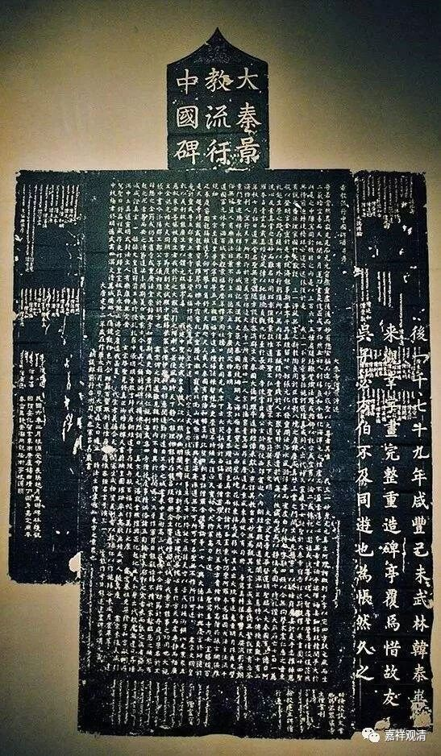

**《微课堂佛教史》24·1**

好，我们继续佛教史。其实现在每天讲佛教史、讲《心经》，压力还挺大的，我们就聊聊吧。

佛教史现在讲到中观进入中国，那么，在中观进入中国之前呢，玄学就好像为中观派开辟了一个战场一样，之后般若经就传入中国。我们大概会以为般若经传入得很晚，其实不是这样的。般若经差不多在三国的时候就已经传入了，诸葛亮说“后汉之所以倾颓”是在桓灵那个时代，是吧？反正那个时代已经有般若经翻译过来了，而且还挺流行的。

有些人可能出于看《西游记》的原因——包括我自己小时候看《西游记》也是一样，就认为玄奘法师去印度求大乘佛法，好像在他之前汉地都是小乘的佛法。其实真的不是这样，大乘和小乘佛教差不多是同时传入中国的。

刚才讲到的桓帝、灵帝那个时代，已经有《光赞般若》、《小品般若》翻译成汉文了。那个时候的翻译呢，按照魏查里教授的说法就称为古译。可以说，最早翻译过来的很多名词呢，不像后来翻译的那么清晰。还有个问题呢，当时用了很多名词是汉地固有的名词，称为格义。格就是格斗的格，义就是意义的义。

格义的意思是什么呢？就是用汉地固有的儒家、道家书里面的名词来比附着翻译佛经，就是用汉地固有的名词来翻译佛教的经典，来帮助理解。早期的翻译和学习都用格义的形式，比如说很多地方会用到“慈”这个字，以前就把沙弥翻译成息慈，是吧？然后按照汉文的思路去解释……再比如后来翻译的“性空”，早年就叫“本无”。其实“性空”翻译成“本无”，是完全正确的。但他主要是“格”到了什么呢？“格”到了道家的“本无”——本来是没有，是吧？从无到有，是这样格义出来的。

不过，最早翻译一门新的学问进入一个新的国家，可能都要走这条路的。前两天我们在群里也聊过一个事情，基督教好像翻译成现在的汉文，就有一些新的名词，是吧？其实基督教最早进入中国也是一样，在唐代被称为景教，到现在我们还可以看到大唐的景教碑。

基督教刚刚翻译到中国的时候，都把圣人什么的翻译成阿罗汉的，也用到解脱这个词，涅槃有没有我不记得了。包括伊斯兰教最近翻译进来的时候也有这样的情况，“应真”、“大道”啊这些都用……反正这些现成的佛经名词都有，拿过来先用了再说……大家有兴趣的话可以去看一看。

那么，两种文化之间的沟通首先必须要进行翻译，就会造成初期的这种翻译。比如说印度文被翻译成汉文的，就一定要能够和汉文化固有的名词结合得起来，至少要让大家能够看懂一点。最早的翻译差不多就是这个情况。佛典的翻译到了玄奘法师那个时候应该是完全成熟了，这时候，在翻译过程中照顾到印度文原来的意思会更多一点。不过也慢慢地在翻译当中制定了很多规矩，比如五种不翻或者七种不翻什么的诸如此类。

