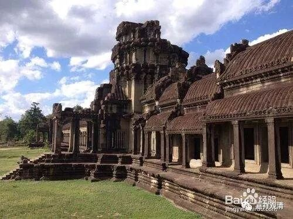
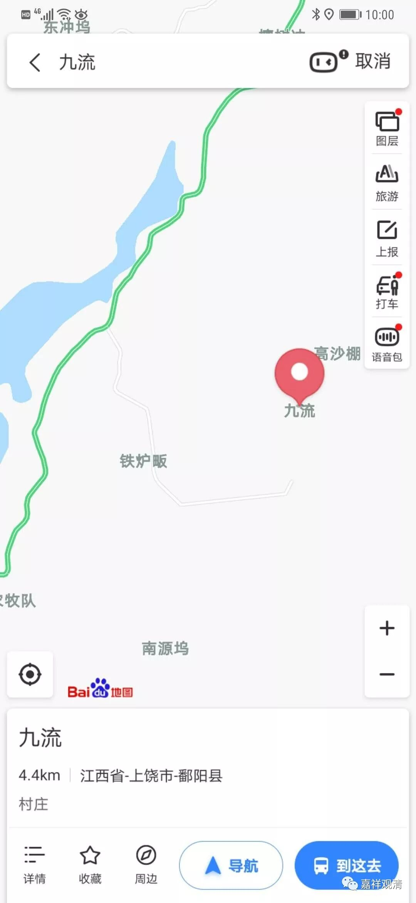
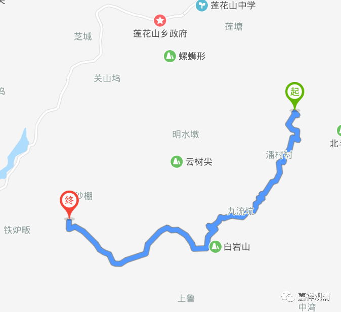

**《善说精髓》084（78）**

大乘宗则在“补特伽罗无我”上还要立“法无我”。

唯识宗立的“法无我”，各宗义书里说的略有不同，但都许“能取所取异体空”为唯识的“法无我”。颂文里说“** 计二取为异物**”，就是“能取所取异体空”了，有些地方说的是“色与执色之量异质空”，个人感觉不如“能取所取异体空”好，“所取”并不单单是色啊。另外，“能取所取空”和“能取所取异体空”略有不同，但泛泛地说来，“能取所取异体空”在安慧系和护法系都可以接受，所以一般多用“能取所取异体空”了。对护法系而言，单纯从字面上理解“能取所取空”是不够的，必须“能取所取异体空”。若从安慧系角度来说，“能取所取空”就足够了。

《宗义建立》只说了唯识宗的此种法无我。

法幢《宗义建立》：

** “（唯识宗建立）‘法无我’之事例，如空掉色与执色量质异之空性。 ”**

若据二世嘉木样大师的《宗义宝鬘》和《土观宗义》（估计还包括《章嘉宗义》，此三位大师是师徒关系，可以理解为是一个学派）则唯识宗所许的法无我里，有粗分和细分的不同，粗分的法无我是“由无方分极微合集的外境空”，细分的法无我，则为“能取所取异体空”以及“自执分别事所执之自相空”，后者拿三性来讲，其实说的是“依他起上无遍计所执自相”。

土观《四宗要义》：

** “（唯识派所许）……其法无我中，谓：于自执分别所著事上由自相空，及能取、所取二取空并外境空等，立为微细法无我。其由无方分极微所集之外境空，立为粗分法无我。”**

若以汉传唯识的语言来说，大致可以这么理解：唯识所不共的“空性”（法无我。共的就是“补特伽罗无我”）建立有三：1、“三性三无性”背景下的“依他起上没有遍计所执”的空性（“圆成实性”）；2、能取所取异体空；2、离心的外境无。其中前两者属于唯识所许的“细分法无我”，所破的是“俱生法我执”；后一种“唯识无境”属于“粗分的法无我”，所破的是“分别的、遍计的、粗分法我执”。从这个角度来说，唯识宗实际认为，单纯分别“唯识无境”是不能趋向解脱的，唯有随顺瑜伽行派所许的“细分法无我”的建立才能断除俱生法我执、获得大乘解脱。从这个角度来说，汉地目前大批九流唯识师天天只叨叨的“唯识无境”，根本不是唯识的究竟义！

