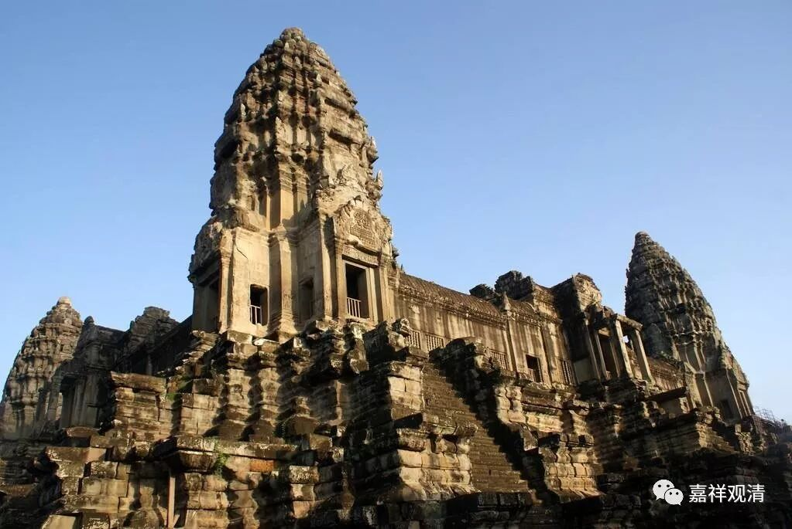

**《善说精髓》084（79）**

下面谈自续派。

自续派又分顺瑜伽行和顺经部行，他们在胜义上都许“谛实无”、“胜义无”，所以表现在“法无我”的安立上，这两家都认可细分的法无我就是“胜义无”、“谛实无”。

世俗上，中观自续顺瑜伽行派就是顺“瑜伽行派”的，那么，瑜伽行派的粗细法无我，在他们看来，都要算粗品的法无我了。也就是说，“于自执分别所著事上由自相空”、“能取所取异体空”、“外境空”在自续顺瑜伽行者看来都是粗分的法无我，都属于遍计的、分别的。（“粗分的无我”的意思是，这种“无我”固然是破除了某些东西，但破除的对象并不究竟，也就是说这种无我并不究竟。）

若就顺经部行派而言，他所许的粗分法无我说是“无方分极微所集之外境空”。

以上是依《土观宗派源流》所说：

“瑜伽行自续中观师许粗、细二种科特伽罗无我之理，亦与婆沙宗同。** 法无我中，则说二取空、外境空及于自执分别所著事上由自相空等为粗分法无我；谛实中无谛实、胜义谛等为微细法无我。**由许一切法于名言中皆有自相、故不许有唯由分别假立及唯由名言安立之法。然许一切法皆由于心或于分别显现增上之所安立也。

经部行自续中观师安立粗、细二种补特伽罗无我及微细法无我之理，与前派同。安立粗分之理则有不同：** 谓许无方分极微所集之外境非有，为粗分法无我**，与唯识宗相同。然许凡是有者，则于自执分别所著事上，必有自相及定有外境也。”

《土观宗派源流》在大乘的粗细无我品上分析的比较细。在《宗义建立》和《宗义宝鬘》里仅谈到了顺瑜伽行派在粗细法无我上的建立——

法幢《宗义建立》：

** “就瑜伽行中观自续派而言，主张空掉色与执色量质异是粗品法无我。诸法谛实空是细品法无我。”**

** 

二世嘉木样《宗义宝鬘》：

** 

** “3，粗品法無我──色與持色之量異體空。

**4，細品法無我──一切法真實存在空。”**

** **

《宗义建立》和《宗义宝鬘》都喜欢用“色与执色之量异质空”，我个人更倾向“能取所取异体空”的表达。《宗义建立》和《宗义宝鬘》并没有提到顺瑜伽行派的另两种空性，以我对唯识的了解，应该加上更完整一些。

《宗义建立》和《宗义宝鬘》也都没提到自续顺经部行派的粗细法无我的安立，其中，细品的“谛实无”应该可以肯定的，至于粗品，我估计自续顺经部行派本身并没有提出过明确的说法，《土观宗派》的说法应该是推理而来的结论。

