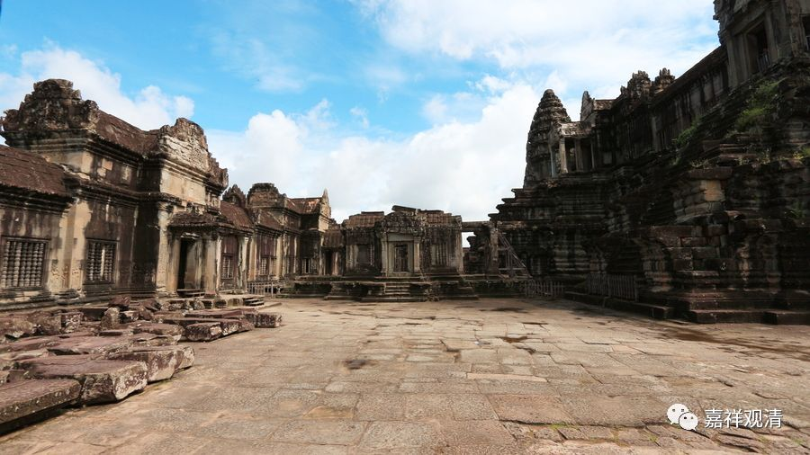

**《微课中观史》25·3**

道安法师做了几件非常了不起的事情：第一，他自己进行了文献的收集和整理。第二，他对整理的文献进行了研究。第三，他还教化出了很多弟子。在这些弟子当中，有些人物是中国佛教史上很重要的，比如庐山慧远法师和他的很多同学，都是当时首屈一指的大师。他的一些弟子或者再传弟子，后来又成为鸠摩罗什法师的弟子。基本上可以这么说，道安法师为鸠摩罗什法师的到来储备了大量的佛教顶尖人才。

这几件事情中间的任何一件事情，即使发生在一个人身上已经非常了不起了，更何况我们的道安法师是一个人具备了这些，很厉害啊！在中国佛教史上这样厉害的人并不多见，道安法师真正是一个划时代的人物。

凡是划时代的人物，都有一个比较牛的老师。道安法师的老师呢，是中国佛教史上比较著名的一位神僧——佛图澄，应该说是在佛图澄的传记当中，属于神僧的一面表现得比较多。不过现在看起来，除了说得比较多的神僧的这一面，他应该还是有比较丰富的、比较厉害的教理基础。

但是，那个时代实在是太乱了，大致是什么时候呢？就相当于“五胡乱华”那个时候，南北朝时期的。当时西晋灭了以后，整个中原一带就出现“五胡乱华”的一个大乱局，什么匈奴、羌、鲜卑、羯、氐这些胡人部落纷纷称帝，残暴得……就像我们现在说的种族大屠杀，在中原一带数次出现，应该说是非常非常之混乱。

这时候呢，有一个西域来的异僧——佛图澄就出现了。

在这样一个乱世，大型的聚徒讲经、弘法利生、开宗立派都是不大可能的了，于是，佛图澄便以一个异僧的形象出现以保存佛教，尽可能地为佛教保存一点种子、教出几个好苗子，管住几个暴戾的皇帝……传记里面，佛图澄的神通很大，以此来折服当时的统治者……

关于道安法师的师父佛图澄，内容很多哦，我们慢慢再聊。

今天先到这里，谢谢大家。

