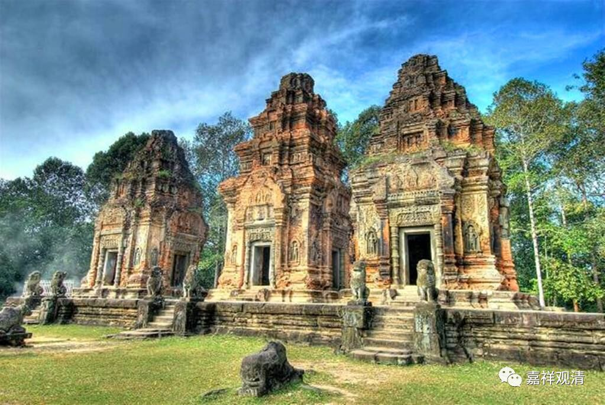

《微课堂佛教史》026·1

继续，佛教史的中观部分。现在讲汉地的中观史……

在史称“五胡乱华”的那个非常混乱的年代中，就出现了这样一位异僧或者高僧——佛图澄大师。当时好像石虎他们家非常信仰他，本来是根本不信，佛图澄大师就直接显露神通，而且是非常厉害的神通。传记当中对这方面的内容写的非常多，写他如何直接显露厉害的神通，什么几千里之外的打仗赢不赢他都能看清楚了，都说对了。

这些神迹直接就把当时那些暴戾的蛮族统治者给镇住了。本来人家都不信佛的，却一下子给镇住了。（说实话，发生在我们身上，我们也得被镇住——直接告诉我叙利亚下个礼拜搞定土耳其，然后还准了，这必须服啊！）被他镇住了以后，就出现了什么情况呢？那些暴戾的君主，忽然就全都信佛了。

当然，究其根本上来说其实只是信的神通，但至少对佛教势力会有敬畏，在他大杀四方没有顾忌的时候，在宗教方面会稍微收敛一点。但这种“敬畏”又有其两面性，另一桩同期的公案里，强力君主让地方割据政权“上缴”神僧时，由于害怕神通为敌所用，索性就杀了完事……

同是南北朝时期，北魏拓跋焘听说昙无谶大师有神通、能预言，派人到北凉找沮渠蒙逊要昙无谶。沮渠蒙逊的北凉那是河西走廊的割据政权，实力远不如北魏，所以不敢拒绝；但又怕昙无谶去了北魏之后，其神通为敌所用，于是索性杀了昙无谶……唉，所以有了神通也未必就一定有正面的效果啊——神通大不过业力啊！

我们讲“五胡乱华”，那还不是一个外来民族，而是好多个外来民族。那些民族都信佛了，影响到了他们上层阶级的信仰，甚至还影响到了他们的皇位继承问题。

比如说，现在中国的佛教石窟当中比较有名的是云冈石窟，对吧？我们去云冈石窟里面看看，那些大的佛像都是为皇帝造的。就是，假如你这个皇帝造不出一尊佛像，你就别想混了，就别想当皇帝了。即使你能造得出佛像，你还得确保：第一，这佛像要跟你自己像；第二呢，这佛像还得要有特殊的地方跟你像。要把佛像雕刻得跟你自己像，还是比较容易的。但是假如说，你雕刻的这尊佛像的山石，突然之间在你自己身上有痣的地方，对应的地方也出现了一块黑色的石头，那就不得了，你当皇帝的政治基础可以说至少在社会的中上层是稳如磐石啊。这类佛像叫什么呢？我给大家透露一个消息，这些佛像叫“等身像”。（我只能说这么多了……想知道更多的……就当我没说）

