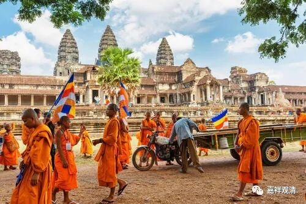

**《微课中观史》26·2**

那么佛图澄大师呢，就是道安法师的师父，那个时候在北方的少数民族上层阶级对他服得不得了。没看到他专门讲经传播佛教，基本上都是显露神通。也因此呢，很多学佛的人就聚集在他的周围。

他的神通呢，就比如说，你想要看个荷花，他就拿盆水来给你看，直接搞出一盆荷花来。这个幻术有点厉害的。我个人认为，这里面肯定有幻术——我们现在讲的魔术——的成分。当然，也可能是一些神通，比如他的传记当中讲的那些千里之外的战争都能看得清清楚楚，这个力量有点强。

还有一个原因是什么呢？那个时代中原的佛教都是从现在的新疆——也称为西域传过来的。那个地方以前是上座部有部主要的教区，而上座部是比较强调禅修的。禅修的背景呢，就可以修神通。有了四禅八定再专门修就比较容易修出神通，也不是比较容易修出神通啦，差不多神通都是通过禅定来修的吧。这是他们的一个强项。

之前中国的其他宗教当中是没有这些禅修背景的，佛教进入以后，除了有祭祀啊，除了有戒律啊，、宗教哲学啊，还有禅修的背景，这就大大丰富了中国宗教的内容。所以鸠摩罗什法师一进入中国，请他翻译的除了那些大乘的经典之外，还有一些有部背景的禅修的或者禅定的经书。而且鸠摩罗什法师原先是学有部的嘛，他有部学得很好，所以也有传说鸠摩罗什法师也有很多神通——好像和尚不会神通在江湖上就没办法混了。宗教的传播似乎天然地捆绑“神通”……

有些传说里说罗什大师吞针后“逼”出毛孔来为为自己“辩护”，呵呵，这种后期的传说也只有文化程度不够的人会信，他们的信心往往建立在这些虚妄的高峰上。其实传记里说是国王逼他取妻，而罗什大师对弟子们说的是：“譬如臭泥中生莲花，但采莲花，勿取臭泥也！”

我们来看看《高僧传》吧：

“姚兴常谓什曰：“大师聪明超悟，天下莫二。若一旦后世，何可使法种无嗣？”遂以妓女十人，逼令受之。

自尔已来，不住僧坊，别立廨舍，供给丰盈。每至讲说，常先自说譬：‘譬如臭泥中生莲华，但采莲花，勿取臭泥也。’”

也许历史不如传说可爱，但历史比传说真实而动人！

