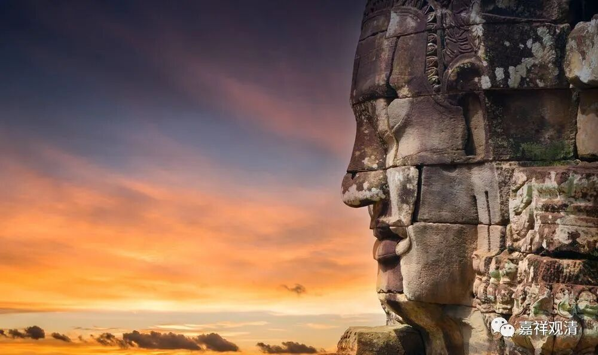

**《善说精髓》084（85）**

** “解修无我断我执，非理作意分别灭，**

** 彼见为本贪等灭，彼所起业亦随灭，

**即无生死业所引，便得解脱当坚信。”

** 

理** “解”**进而** “修”**持** “无我”**能够** “断我执”**；则由我执而生的** “非理作意”**及诸戏论** “分别”**也得到** “灭”**除；以** “彼”**萨伽耶** “见”“为”**根** “本”**的** “贪等”**烦恼亦得** “灭”**除；** “彼”**无明** “所”引“起”**的** “业”**等** “亦随”**之** “灭”**除；彼** “业所引”**生的** “生死”**轮回亦** “即无”**存，由此** “便得解脱”**——这个道理应** “当坚信”**。

也就是说，解脱的核心环节就在通达并实践无我见，所以我们应该仔细学习、串修，除此以外，别无他法能断轮回！

《法句经》说：

** “失眠者夜长；**

** 疲倦者路长；**

** 不知正法者，**

** 苦惑轮回长。”**

唯有通达正法，才能free。我们是被什么束缚的呢？自性执，断除自性执的也只有生起自性空的认识。

佛经里说：

** “诸佛非以水洗罪，**

** 非以手除众生苦，**

** 非将自证迁于他，**

** 示法性谛令解脱。”**

抛弃幻想吧——解脱是没有谁能够送给你的

踢晕过去八回也不行！

我很喜欢阿姜查大师的一个故事：

有一次，大师去村里给民众祈福。他的西方弟子看到他把水撒到村民头上，对此颇有不解，便问老师，这样的洒水有什么意义？

“也许是这几天太热了，”阿姜查回头，笑着说，“他们需要淋点水稍稍凉快一下……”

