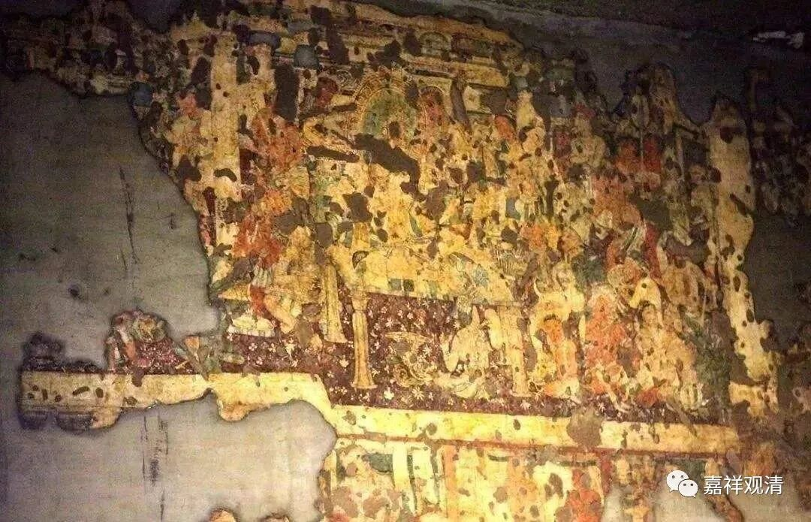

**《微课堂佛教史》028·1**

所以，阿毗达磨在当时就被大量地翻译过来，特别是有部的阿毗达磨。再加上后来鸠摩罗什法师又翻译了《成实论》——这是经部的阿毗达磨。到了这个时候就出现了一个情况，就是几乎全中国的高级知识分子的和尚都很努力地研究阿毗达磨——当时叫“数论”。“数”，就是数字的数，“论”，就是论典的论。以前也叫“毗昙”，“毗昙学”在一段时期里被称为显学，是大家都愿意学习的，因为这是佛教的基础嘛，而且大家都不懂。（甚至还有人放弃大乘而专治毗昙的，后面会提到。）

在汉传佛教当中，我们通常讲的除了大乘的八个宗派（禅、净、律、密；三论、唯识、天台、华严）以外，还说有小乘的两个宗派——俱舍宗和成实宗。其实俱舍和成实唐以后基本上是附于唯识和三论而传播的，很难说独立成“宗”；但是在南北朝时期，有部系统和成实系统确实有师承授受，当时称为“毗昙师”和成实师：“毗昙师”，就是有部师。说起来，每个佛教部派都有阿毗达摩——毗昙，但由于当时集中翻译了有部的阿毗达摩，所以就把“毗昙师”直接送给有部了。另外“成实师”实际应该是小乘的经部一系，但当时很多成实师们是把它当作是大乘来弘扬的，被称为“成实大乘”。“成实大乘”的实力一度遥遥领先于其余佛教流派，后来在天台师和三论师的合力破斥下衰微，现在连一本注解都找不到了。

此事后话，暂且不表……

当时翻译过来的这些阿毗达磨，在中国佛教的上层知识分子中间一度非常流行，大家都在学习阿毗达磨，都在学习经部和有部的佛教的基础内容。通过这些内容的学习以后呢，再碰到中观，再碰到唯识，他们的基础都是非常扎实的。

在魏晋南北朝的后期，包括隋朝、唐代的前期和中期等等，大部分的中国高僧就是具备了这些阿毗达磨的背景，都掌握了佛教的基础知识。我们可以看到净影寺慧远大师就著有《大乘义章》，对这些内容进行了总结。这些应该说是体现了当时的大师们的基本素养，很可惜这个习惯到了大唐的中后期又重新丧失了，到后来大家还是不太喜欢学习阿毗达磨，因为中国的知识阶层普遍认同“言不尽意”，那么，以言诠为特征的“法相”就成了大家普遍刻意扬弃的部分，而纷纷去追求“密契”于本心，“知苦、断集、证灭修道”的四谛教法终于在汉地** 也**开出了“新花”——“修灭”。（咦，我为什么用了“** 也**”？）

