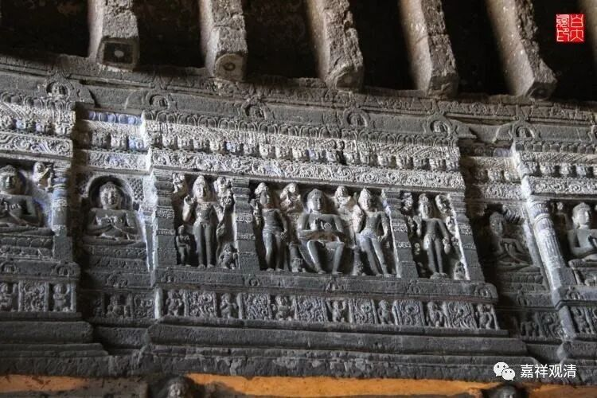

**《微课中观史》28·2**

我们再往后面翻翻，看看汉地的中观派（就是三论宗）的几位主要人物，你可以发现他们在阿毗达磨方面是相对熟悉的，或者说他们对于有部和经部的那些内容都是相当相当了解的，主要就是对有部和经部的名词的解释。当然，这样也出现了另外一个问题，就是很多人就把中观讲得跟《成实论》一样，或者把唯识讲得跟有部一样，这种情况也是有的。其实这种情况到现在也还是会出现。

不管怎么样，我想说的是，那个时代（南北朝）并不是我们现在（一般佛教徒）所想象的好像没什么人才的样子，或者大家的学识水平、佛教水平都不高的样子，其实并不是这样的。那个时代所缺乏的是什么呢？那个时代非常缺乏的就是，大家不知道怎么去整理出一条线来，这个也就是后来藏传佛教界，特别是在宗喀巴大师之后，给我们带来的一种非常非常特别的道次第的理路，包括宗喀巴大师在学术方面也是一样，能够很清晰地理出一条线来，这是非常非常难能可贵的。向大师敬礼！

南北朝时期，有相当多经典都翻译过来了，大家就看到那么多的经典之间，或者前后之间好像说的还都不一样，小乘和大乘也不一样，包括《成实论》和中观不一样，和唯识也不一样——到底是怎么回事？可能当时人们还没有过多地从部派上面去了解，主要是从经典上面去看——《涅槃》有《涅槃》的说法，《华严》又有《华严》的说法，然后《法华》还有不同的说法，这还不是后面的宗派差别哦，确实有很大的差别。

比如说，《涅槃经》说佛陀早就成佛了，《华严经》又说是这个时候刚刚成佛然后上去各个天，诸菩萨云集的……再到各处天宫讲经（其实更像成佛后在各处主持佛教研讨会）；《法华经》呢，也说早就成佛了。还有很多小乘的经典也都是说刚刚成佛的，说之前还是凡夫……众说纷纭啊。在没有一个完整清晰的思路整理出来的时候，大家其实是学习得有点乱的。这时候就需要一个比较完整的部派型的解释，需要把这些“散装”的经典拉出一条理路来。

还有一点呢，之前是传入的这些小乘的典籍，会让大家觉得小乘和大乘的经典有点对不上。说实话，当时已经出现了一个情况，就是用小乘的经典来解释大乘的经典，还自称是大乘的，包括在后期也出现这样的情况。（其实一直到现在都有，很多讲经的时候大小乘观点嵌着讲，我有个师父给取了个名字——旅游派。）

还出现了一个什么情况呢？包括鸠摩罗什法师的弟子中（还有点名气呢）都出现了这样的情况，是什么呢？就是有大乘来的时候他（慧观法师）就变成大乘，过一段时间他离开鸠摩罗什法师了，然后又碰到小乘的经典了，他又归依小乘了——心的转变非常快。这也是没有办法，因为佛教在当时还只是一个外来文化，在被翻译过来以后还不完整，大家都跟着这种流行的节奏走。对的，“流行”这个词给他们很好，他们追的是流行的佛教，心里没啥主见（宗见）。说起来，这还是中国文化基因造成的，《庄子》表达的所谓“此亦一是非，彼亦一是非”，观点太多，无所适从，怎么办？“凉拌！”

庄子看见拧着长的大树，说无用能长生；马上又看见主人杀了不会叫的鹅，却是无用的先被杀（打脸好快）。脸打得很疼，我们的庄先生只好选择“不选择”或者“看情况选择观点”了。中国人的聪明（滑头）在这里，束缚也在这里……

