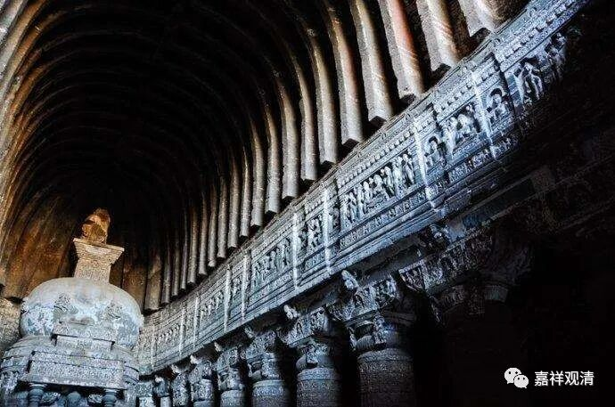

**《善说精髓》084（89）**

这时候对方说：“** 经说见我为见蕴**”，有些经文当中说“见我即见蕴”，那不明确说的是“即蕴我”吗？

对此，自宗解释说：

经文里那么说，“** 意**”思是“** 在破除”“离蕴我**”，并不是肯定“即蕴我”。比如，在其他经文里也说蕴非我。

一般来说，我们说外道许有“离蕴我”；内道说“即蕴我”，如有部说是蕴聚、经部说意识相续、唯识说第八识或者第六识，自续说内识相续；特别的犊子部，则说“非即蕴非离蕴”但是有个实存的我。自宗则说，我（补特伽罗）为依蕴假立，蕴等为我的安立处、是安立“我”的所依处，而我是在此上安立的能依，能所不是一，比如工匠不是瓶子。

自宗的意思是，名言我是不妨存有的（但非实有），唯名言安立、唯分别增上安立，如果认为这还不够要继续追究这个“我”究竟是什么，想要找到那个最后的什么是“我”，这就是想要找我的自性了，而这种“自性我”是根本不存在的。我举个（试试看，未必很恰当）例子，虚数i，√(-1)，它不是实数，可以用来解题，有用——无实体而有作用。

在他宗而言，“施设的我”是可以接受的，但他必须有个是他的东西——蕴聚、自识相续、阿赖耶……等等，他们认为，单纯的施设是不足以存在的。自宗说：唯施设的我为世俗有，推寻其究竟则在推求胜义，而中观宗则认为，胜义是无（自性）的。而且，即便在其世俗上，也不是自性有的——你只要一去推求唯施设背后的“有”，那就是迈入了胜义的范畴了，就已经不自觉地承认了胜义有了！

再比如我们说“往东走”的“东”，你只是往施设的“东”走遍是，你要去推寻究竟哪个是“东的本质”，便无法找到它。唯施设的“东”，有；“有自性的东”，没有。世俗的东，有；胜义的东，没有！

