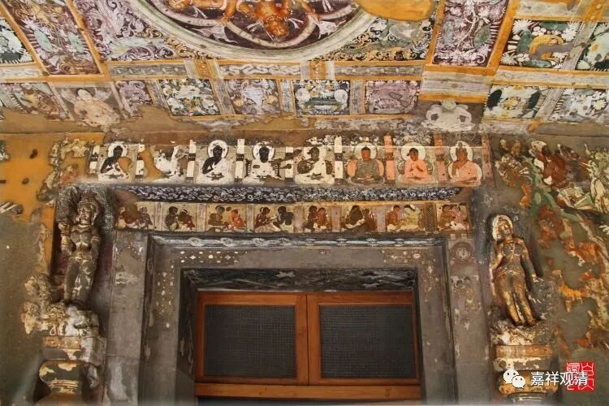

**《善说精髓》084（90）**

** “酉二、抉择彼无自性

**分三：戌一、抉择我无自性，戌二、抉择我所无自性，戌三、示依此补特罗如幻现起之理。**

** 戌一、抉择我无自性

**知我见相所破要，遮实三聚周遍要，

** 见难二成宗法要，顺引定解所成要，

**具此四要生正见。”

抉择我无自性部分。一般常用的是四扼要，来自《菩提道次第略论》。本论与《略论》有小异，但意思是一样的。

《略论》说的四个扼要是：

** “戌一抉择我无自性。

**此中有四纲要：

** 一、当观自身人我执执著之相，如前已说。

**二、当观补特伽罗若有自性，则与诸蕴或是一性，或是异性，离彼更无第三可得。如瓶与柱，若决断其为多，则遮其为一。如但曰瓶，若决断其为一，则遮其为多，更无‘非一非多’之第三聚可言。故当了知，离一异性，亦定无第三品也。**

** 三、当观补特伽罗与诸蕴是一性之过。

**四、当观彼二是异性之过。**

** 

** 若能了知如是四纲，乃能引生通达补特伽罗无我之清净正见。”

** 

这是说，抉择我无自性，一般从四个方向来讨论：

首先，你要找到你要破的那个东西——“补特伽罗我执所执之相”。就是自性我、补特伽罗自性。前面讲过了，自宗说“唯名言我”非所破，是不妨安立的；“自性我”则是所破。

“所破”有两种，一种是道的所破，就是烦恼，烦恼是有的；一种是正理的所破，就是诸法的自性，这是从来都没有的。这里的所破“自性我”是正理的所破。

第二呢，就是抉择、分析，我们找到这个“自性我”的时候，他如果存在，那他和蕴只有两种关系一、或者异，没有第三种情况。

这个要很认真的抉择过。类似破案，上面第一，我们先要拿到嫌疑人的照片，要明晰他的特征，然后第二步呢到大楼里来找了，只有几个出入口，全部堵住，搜查。或者把大楼网格化，一个格子一个格子排除。这一步当中最重要的是，必须要“周遍”——几种可能，全部考虑到，不怕多，就怕漏。如果全都搜遍了，找不到，那最后确定，嫌疑人不在这栋楼里（或者抓到嫌疑人）。

这里也是一样，确定清楚，只有一异两种。有人说“非一非异”，对不起，在这里没有“非一非异”。也就是说，这里的“一”和“异”，就是两分，没有第三类。两个实有的东西比较，除了一，就是异，没有第三种。

第三呢，就是（有自性的）补特伽罗和蕴，一，不成立。

第四呢，就是补特伽罗和蕴，异，不成立。

这样的结果就类似于刚才的比方，嫌疑人在大楼里可以确定找不到了。在这里则可以确定，我执所执的对象（自性我），根本不是存在的法。

** **

