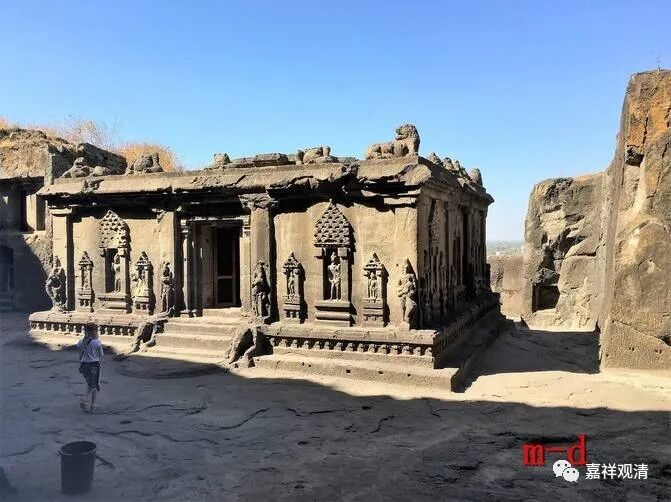

《微课堂佛教史》029·1

我们继续来讲佛教史，讲中观派在中国汉地发展的历史。

上次是讲了鸠摩罗什法师来到中国之前汉地的一些情况，哪怕现在仍然存在这种情况，就是我们上次讲到过的关于“格义”的问题。“格义”在中国汉地佛教的发展早期是属于没办法，但现在完全没必要。佛教已经很完整地传入中国了，名词体系等等都很完善，突然之间又去搞量子力学这些东西比附，真的没必要，没有任何的意义。

这只能体现你既不懂量子力学，又不懂佛教。这种情况基本上就是两个都不懂的人在那里谈，但凡两个当中稍微懂其中一个的，就不会这样去比附，这两者之间没什么关系的。如果非要说有关系的话，那就跟做油条和空性的关系差不多一样了。任何的法当中都有它的空性，你要谈什么都可以谈，一样。总之，多半是那些不懂的人在聊，这个比附是完全没有必要的。

那么，佛教的早期是因为刚刚传入中国，要用一些中国固有的语言去讲。后来大家开始对此有自觉，到了道安法师那个时候，他提出尽量不要用“格义”、比附这种方式。到了鸠摩罗什法师以后，这种“格义”就很少见了。

还有一个原因，上次我也讲过了，在这个时候或者在此前后，有部和经部的阿毗达磨都被大量地翻译过来，特别是有部的。佛教的这些名词大量地、成建制地被翻译过来，使毗昙学（阿毗达摩）成为那个时候的一个显学。大家都在学习毗昙的这个情况应该是中国历史上佛教的学习背景下整体环境最好的。有时候外部环境的艰苦，反而也可以促进佛教的发展，并不一定是外部环境很好才能发展。

那个时候，从南北朝后期一直到隋唐时期或者唐代中期，可能是中国佛教的学术性或者学习的严谨性、大家努力的程度最高的，这是平均起来看。所以那个时候一代一代的大师、一批一批的大师出现了。再往后，除了禅宗就没啥可看的了。

从南北朝时代的学习来看，包括后来纷纷组织的大乘的八个宗派和小乘的两个宗派的那些大师们的经历来看，阿毗达磨的学习是非常重要的。

我们现在对阿毗达磨好像都不是很看重，中国唐代中期以后，基本上就没什么人去看或者学阿毗达磨的，几乎没有，认真学习的人非常的少，所以对这种基础性的概念、基础性的名词欠缺的太多了。

我建议大家有空还是多学学阿毗达磨，首先要学习佛教这些基础的名词解释，或者是至少要对这些名词有所认识，否则看到听到以后是什么东西都不知道，什么五蕴啊、十二处啊、十八界啊，哪个都不懂，都讲不出来。现在有人讲经的时候还说眼识就是眼睛，还有个别湖边上的“国学大师”说“眼识界”就是眼睛和色中间隔着的那一层，真是胡说八道、信口开河。不懂就应该藏拙，这样能装久一点。

我已经讲过好几次了，是吧？还是希望大家有机会、有兴趣的话，真的是可以好好学习阿毗达磨。你至少至少也要学个《百法》，把这一百个法学下来，有能力的话，再学习《五蕴论》或者《广五蕴论》、《集论》。阿毗达磨的学习，这是一个基础。所以在支那内学院就说，想正式学习佛教的话，刚开始先学什么呢？先学两个，一个是因明，一个是阿毗达磨。

