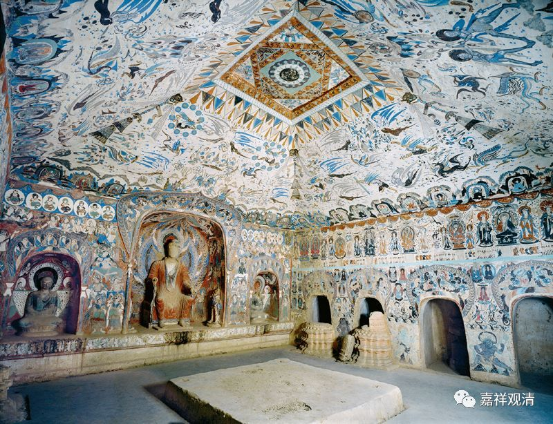

**《善说精髓》084（91）**

本论的四扼要略有不同。分四个：一、所破扼要；二、周遍扼要；三、宗法扼要；四、所成扼要。第一第二，相当于《略论》的前两个纲要；第三个宗法扼要，相当于《略论》第三第四个纲要部分；本论第四个扼要，相当于《略论》的结论部分。

特别地把“结论”提出来单独列一个科判，我觉得从实修上来说确实是一个亮点——经过前面分析以后有了一个结论，在这个结论上把心安住下来，这确实有单列的必要。而谛实一异的分析，也在分析的时候虽是前后两个部分，但在一般情况下这两个串联起来思考比较合适。

所以这部分呢，分四、分五怎么分都可以，内容本身没啥差别。

一、** “所破”**扼** “要”：“知”“我见”“相”**，就是明白地知道我执所执着的对象的样貌；

二、** “周遍”**扼** “要”：“遮”**除** “实”**有的** “三聚”**，就是说，补特伽罗如果是实有的话；它和蕴除了是“谛实一”或者“谛实异”这两种可能，以外，再也没有第三种可能。

其实这第二个观点还是蛮重要的。我们一般人在这上面基本是死结，死在这第二点上极多。比如拿造庙来说，我徒弟经常和我有这类对话。

例一：

LAS：师父，下水道堵了。

我：修吧。方案一和方案二。

LAS：第一种方案太贵；第二种方案村民不同意……

我：那就不修。

LAS：不修不行。

我：那有没有第三种办法？

LAS：就这两种没有第三种。

我：那就是方案一和方案二里挑一个。

LAS：第一种方案太贵；第二种方案村民不同意……

我：有没有第三种办法？

LAS：就这两种没有第三种。

我：那就是方案一和方案二里挑一个

LAS：第一种方案太贵；第二种方案村民不同意……

我：有没有第三种办法？

LAS：就这两种没有第三种。

……（重复N次）

我：你中观学的好啊，这是两头堵我啊。既然没有其他办法又必须要修，很简单，要么说服村民，要么多花点钱一劳永逸地做个新的工程……

我们一般人的思路就是这样：

例二：

刑警新人类：这小偷一定在这里没走！

队长：只可能在这两个地方？

新人类：是的！

队长：都找过了？

新人类：都找过了！没有！

队长：那小偷就不在这里……

新人类：不！这小偷一定在这里！我看到的！

队长：只可能在这两个地方？没出去过？

新人类：是的！确定！

队长：都找过了？

新人类：都找过了！没有！

队长：那小偷就不在这里……

新人类：这小偷一定在这里！我看到的！

……（重复N次）

例三：

甲：东西呢？我记得放在包里的！

乙：确定吗？

甲：确定！

乙：只有两个口袋啊！都找了吗？

甲：找了，都没有。

乙：那就在其他地方。

甲：不！我记得在包里的！

乙：确定吗？

甲：确定！

乙：只有两个口袋啊！都找了吗？

甲：找了，都没有。

乙：那就在其他地方。

甲：不！我记得在包里的！

……（重复N次）

所以，绝大部分人都死在第二个扼要。

我在跟人沟通的时候，经常在这类地方下被打成“连环劫”，看着对方是又好气又好笑。其实很简单，要么预设不对——“小偷不在这栋楼里”“钱包不在手提包里”，要不就是答案不“周遍”（没有全部包括进去）——“除了这两个房间还有其他地方”“包里还有个夹层”。

第二个扼要，一定要确定，在补特伽罗实有的背景下，有、且只有这两个答案！心里在没有确定“有且只有……”之前，后面分析也没意义……

