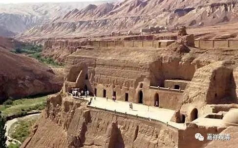

**《善说精髓》084（92）**

三、** “宗法”**扼** “要”**；“** 见难二成**”，就是，见“补特伽罗与蕴是谛实一”和“补特伽罗与蕴是谛实异”这二者都难以成立。这在《略论》则分二，在本论则合为一。

不多展开了，展开的话太广了。这里稍微提两句。

如果“补特伽罗与蕴是谛实一”，那么，1、蕴有五，难道补特伽罗有五？2、或者补特伽罗是一难道蕴是一？……

如果“补特伽罗与蕴是谛实异”，那么，1、非蕴的存在，是无为法，难道补特伽罗是无为法？2、如果补特伽罗是无为法，还要辛辛苦苦证无为法干嘛？本质上就是了嘛！3、如果补特伽罗是离蕴而有，而苦的本质是五取蕴苦，那我根本就不应该有苦嘛！……

这个科判的内容可以展开很多，大家可以参阅诸大经论。这里就不多说了。总之，证明的道理很多。

四、** “所成”**扼** “要”**：“** 顺**引定解”，基于上述的过程，顺势引生通达补特伽罗无我之清净正见。

按前面的比方，就是：1、拿到嫌疑人的照片和特征介绍，越详细越好，DNA这些特异性的材料能有就有；2、确定只能是“男人”和“非男人”；3、“男人”、“非男人”里全找遍了，没有；4、确定“如材料里所说的这个嫌疑人”不存在。

** “具”**备了** “此四”**种“** 要”**点则能“** 生”**起补特伽罗无我的“** 正见”**。

本论和《略论》等都分四阶段，特别是按《略论》来说是要有四个分析的过程，然后得到结论。其实也可以不以“一异”抉择，而用其他方式，比如《入中论》说的“七相推求”：

“如不许车异支分，亦非不异非有支，

不依支分非支依，非唯积聚复非形。”

即：1、非异支分（非“我与蕴为异”）；2、亦非不异（非“我与蕴为一”）；3、非有支（非“我拥有、使用五蕴”）；4、不依支分（非“实有的我依于五蕴”）；5、非支依（非“五蕴依于实我”）；6、非唯积聚（非“蕴堆积生实我”）；7、非形（非“依形相的堆积生实我”）。

如果依“七相推求”来说，按本论，也可以分四：第一和第四不变，第二“周遍扼要”的内容是七相推求“遮实八聚”；第三宗法扼要里面就是“见难七成”了。

