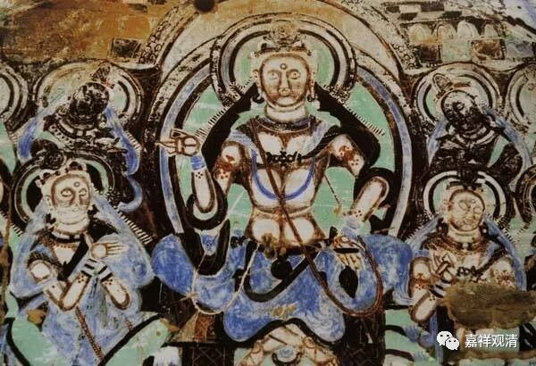

**《微课中观史》29·3**

还有一个实践的问题就是出家这个问题，中国一直不接受的就是出家。我们刚才说到戒律的问题，戒律本身是比较容易抄的，过来以后大家也没有太大的问题接受。但是出家，也是南北朝时期讨论的一个问题：出家到底是孝还是不孝？

另外呢，禅修也是一个比较大的问题。在鸠摩罗什法师进入中国以前，已经有一些禅修的著作被翻译过来。北方就比较流行这些禅法，也比较流行这些修行的方式——到山里去打坐。

前面我们讲过道安法师的师父佛图澄大师，他在当时被认为是一名神僧或者异僧，在南北朝时期的北方，外来的和尚很多，好几个都被记载为有神通。而这些神通的背景就是禅定。很多人为了获得神通，也要求去修禅定（我们小时候认真打坐，不也是想获得特异功能嘛……）。当时所传过来的主要都是有部的、上座部的一些禅法，也包含了这里面的数论。因为在阿毗达磨当中，都会包含十遍处、四念处等种种的修法。

如果你是一个出家人，我们可以想象一下，在一个比较混乱的时代，你容易出现什么情况呢？主动也好被动也好，都会比较倾向于到山里面去禅修。而在一个比较开明的、政治环境比较好的时代，或者比较和平的年代，容易出现什么呢？大型的讲学。

在南北朝时期，北方是比较混乱的，南方相对平稳，于是就出现了北方以禅修为主的高僧比较多，南方以讲究义理的高僧比较多。也可以这么说，北方的高僧比较容易出现禅修增上的背景。南方的僧人呢，其实未见得都是南方本土的，很多都是从北方再跑到南方的——因为相对来说南方的环境比较好，然后再进行聚徒啊、讲学啊等等，这种情况还是比较多的。

这就是鸠摩罗什法师来中国之前的一个时代背景。好像我们讲这个时代背景的时间有点太长了，大家先大致上有这样一个了解吧。

鸠摩罗什法师是一代高僧，几乎在所有的方面都非常强，在禅修、戒律、中观这些方面都有大量的翻译，同时也有大量的讲学，特别是后期，到时候我们会慢慢讲。

今天先讲到这里，谢谢大家。

